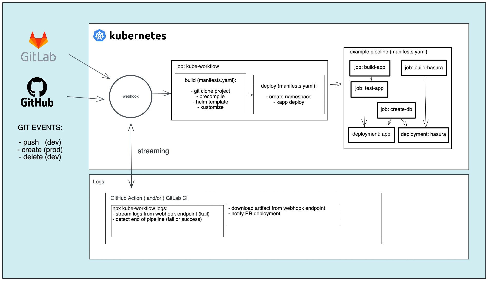

# Kube-Workflow - CI on Kubernetes 🚀

[](https://excalidraw.com/#json=gKk7kOn6a9tbmkRZlPige,IQnqqMuiEPgmWbd39GlUYg)

## GitHub Action Entrypoint

Call it in review, preprod, and prod github workflows

`.github/workflow/review.yaml`

```yaml
- uses: SocialGouv/kube-workflow@master
  with:
    environment: dev
    token: ${{ secrets.GITHUB_TOKEN }}
    kubeconfig: ${{ secrets.KUBECONFIG }}
    rancherProjectId: ${{ secrets.RANCHER_PROJECT_ID }}
    rancherProjectName: ${{ secrets.RANCHER_PROJECT_NAME }}
    # components: app hasura
```

## Configure your project

`.kube-workflow/common/values.yaml`

```yaml
# here you define variables shared by all helm subcharts/components
global: {}

# here you can configure components values
app:
  enabled: true # enable each component
  containerPort: 3000
```

Here is the order, the last in the list is the last applied:

From kube-workflow repository:

- `$KUBEWORKFLOW_ACTION/charts/$COMPONENT/values.yaml` (the defaults)
- default values generated by the pipeline [$KUBEWORKFLOW_ACTION/action/build/values.js](action/build/values.js)

From your project repository:

- `.kube-workflow/common/values.yaml`
- `.kube-workflow/env/$ENVIRONMENT/values.yaml`

## Generate manifests

see kube manifests for your project directory

```sh
npx kube-workflow b -so
```

get documentation of kube-workflow cli

```
npx kube-workflow --help
npx kube-workflow b --help
```

pre-requisites:

- helm v3 [install guide](https://helm.sh/docs/intro/install/)
  ```sh
  curl https://raw.githubusercontent.com/helm/helm/main/scripts/get-helm-3 | bash
  ```
- kustomize v4 [install guide](https://kubectl.docs.kubernetes.io/installation/kustomize/binaries/)
  ```sh
  curl -s "https://raw.githubusercontent.com/kubernetes-sigs/kustomize/master/hack/install_kustomize.sh"  | bash
  ```
- node >= 14
- yarn

## Components

To see all components availables go to [charts folder](charts/):

- [app](charts/app)
- [hasura](charts/hasura)
- [jobs](charts/jobs)
- [maildev](charts/maildev)
- [metabase](charts/metabase)
- [pgweb](charts/pgweb)

To see all availables options by component see each chart's values.yaml file:

- [app](charts/app/values.yaml)
- [hasura](charts/hasura/values.yaml)
- [jobs](charts/jobs/values.yaml)
- [maildev](charts/maildev/values.yaml)
- [metabase](charts/metabase/values.yaml)
- [pgweb](charts/pgweb/values.yaml)

## Components instance

You can declare as many instances as you want of a component, the name must start with the chart's name suffixed by `-`, eg:

```yaml
app:
  enabled: true
  host: ozensemble.fr
  redirectFrom:
    - "{{ .Values.global.host }}"
    - www.ozensemble.fr

app-2nd-instance:
  enabled: true
  probesPath: /healthz
  envFrom:
    - secretRef:
        name: "{{ .Values.global.pgSecretName }}"
    - secretRef:
        name: app-sealed-secret
    - configMapRef:
        name: app-configmap
```

## The "jobs" component

The component called "jobs" is a special component that allow you to define a full pipeline:

```yaml
hasura:
  needs: [seed]

jobs:
  enabled: true
  runs:
    - name: db
      # use: ./.kube-workflow/jobs/create-db # local job, defined in project repository
      # use: https://github.com/SocialGouv/kube-workflow/jobs/create-db # degit full url
      use: SocialGouv/kube-workflow/jobs/create-db # degit implicit github
      with:
        pgAdminSecretRefName: pg-scaleway
    - name: seed
      needs: [db]
      # use: ./.kube-workflow/jobs/seed-db # local job, defined in project repository
      # use: https://github.com/SocialGouv/kube-workflow/jobs/seed-db # degit full url
      use: SocialGouv/kube-workflow/jobs/seed-db # degit implicit github
      with:
        seedPath: path/in/repo.sql
```

see [jobs/create-db/use.yaml](jobs/create-db/use.yaml) for full example.
All vues from `runs` keys will be interpolated in the job, but you can also uses all parameters directly, except the `with` parameter that is reserved to be used with `use` and inject variable to the called job.

All others components can declare dependencies on jobs using the `needs` key, and all jobs can declare depencencies on other jobs and other components too, using instances names.

Mains jobs parameters are:

- `use` and `with`: to include job definition from elsewhere, usage can be recursive (job can use job, that can use job etc...)
- `image` the docker image file that will run the job (default is debian for now, in future this will be a generic image with almost all needed tooling)
- `action` repository (or subfolder in a repository) that will be degitted in mountpoint `/action/` in the job execition
- `run` a custom command that will override docker image default run, can be a full bash script or just a call to a command
- `checkout` (default `true`), this enable the degit of the repository at current commit in mountpoint `/workspace/` in the job

There is a shared storage volume between jobs of a same pipeline, it's mounted at `/workflow/` in the job execution, you can share artifacts between jobs in this directory.

Same as other components, you can define multiple instance of jobs, for example, if you want to use one pipeline from a manual triggered action.

## Merge commons manifests as helm templates

Every yaml file in `.kube-workflow/common/templates` will be merged with the helm Chart `templates` folder before the build.

All theses files can use the Helm templating syntax (or not if you don't need it, helm template is a superset of yaml).

Both extensions yaml and yml are accepted.

## Merge manifests per environment as helm templates

Every yaml files in `.kube-workflow/env/$ENVIRONMENT/templates` will be merged with the helm Chart `templates` folder before the build, according to the `environment` input (dev | preprod | prod).

All theses files can use the Helm templating syntax.

Usually, that's where you put your ConfigMap and SealedSecrets ressources.

## Override and extends kustomizations

The kustomization patches are applied after Helm template rendering.

The kustomization entrypoint is `$KUBEWORKFLOW_ACTION/env/$ENVIRONMENT/kustomization.yaml`.

To override it, create a file called `.kube-workflow/env/$ENVIRONMENT/kustomization.yaml` in your project and containing:

```yaml
resources:
  - ../../common

patches:
# ... put your patches here
```

By doing this way you just optouted from generic kustomization for the selected environment.

If you want (and more often you want) to keep the generic kustomization, containing some infra logic defined by the advised SRE team, you can extends it like this.

```yaml
resources:
  - ../../common.autodevops

patches:
# ... put your patches here
```

You can do it as well for the common base file called by environment kustomizations, just add a file called `.kube-workflow/common/kustomization.yaml` in your project and containing:

```yaml
resources:
  # - ../base # here is if you want to optout
  - ../common.autodevops # here is if you want to extends from autodevops default settings

patches:
  - target:
      kind: Ingress
    patch: |
      - op: add
        path: "/metadata/annotations~1nginx.ingress.kubernetes.io~1configuration-snippet"
        value: |
            more_set_headers "Content-Security-Policy: default-src 'none'; connect-src 'self' https://*.gouv.fr; font-src 'self'; img-src 'self'; prefetch-src 'self' https://*.gouv.fr; script-src 'self' https://*.gouv.fr; frame-src 'self' https://*.gouv.fr; style-src 'self' 'unsafe-inline'";
            more_set_headers "X-Frame-Options: deny";
            more_set_headers "X-XSS-Protection: 1; mode=block";
            more_set_headers "X-Content-Type-Options: nosniff";
```

If you think you patches can be reused by other project, contribute to [common/patches](common/patches) and `env/*/patches` folders of the action by sharing them.

## Charts re-use

All charts are published and released as a chart repository at `https://socialgouv.github.io/kube-workflow/`.
You can use it in your Chart.yaml as:

```yaml
dependencies:
  - repository: https://socialgouv.github.io/kube-workflow/
    name: kube-workflow
    version: "1"
```

`kube-workflow` is the "umbrella hcart" (the main chart in helm jargon), it contain namespace, psp and all others components as subcharts, you can call all components from subkeys in your values, global remain at top.

## Releasing

### Automatic

Execute the [Trigger Release](https://github.com/SocialGouv/kube-workflow/actions/workflows/trigger-release.yml) workflow to trigger a new release of actions and helm charts.

### Manual

Releasing follow semantic versioning using [standard-version tool](https://github.com/conventional-changelog/standard-version). Versioning can be trigerred manually on dev machine to not block rapid iteration of master branch code : just run `yarn release` on master branch and CHANGELOG will be feeded with informations from commits using the conventionnal commit standard, then package will be bumped, as the charts versions and commited, then tagged. Then just follow cli instruction that say: `git push --follow-tags`. Then the action will publish automatically new version of npm cli, and charts index.

## CONTRIBUTING (developments on kube-workflow)

### Test

all directories added to [tests/samples](tests/samples) are like a `.kube-workflow` directory in a project, it will be automatically tested when you will run `yarn test`.
To run only one test at once you can run `yarn test -t name-of-my-test`.
To upgrade snapshots run `yarn test -u`.

### Contribute adding more Helm charts

New charts are welcome in folder [charts/](charts/).
More options on existing charts will be carefully design, in case of doubt, or if you don't want to wait, you can hack everything using kustomize from your repository. Feel free, then give us feedback to ensure we follow best practices and are preserving project maintainability.

Wee need:

- oauth2-proxy-service
  ... (many things that we don't know that we need until we'll have them)

### Contribute adding more kustomize patches

New patches are welcome in folders [common/patches/](common/patches/) and `env/*/patches/`

### Contribute adding more jobs

New jobs are welcome in folder [jobs/](jobs/)

wee need:

- drop-db
- docker-build (using buildkit)
- generate-sitemap
- comments publish to github pr
  ...

### Development resources

#### helm templates

to enable correct syntax recognition and coloration of yaml helm templates in vscode, enable [Kubenernetes extension](https://marketplace.visualstudio.com/items?itemName=ms-kubernetes-tools.vscode-kubernetes-tools)

Resources:

- [Learn YAML in Y minutes](https://learnxinyminutes.com/docs/yaml/)
- [JSON to YAML](https://www.json2yaml.com/)
- [Kubernetes doc](https://kubernetes.io/docs/concepts/)
- [Helm doc](https://helm.sh/docs/)
- [Kapp doc](https://carvel.dev/kapp/docs/v0.46.0/)
