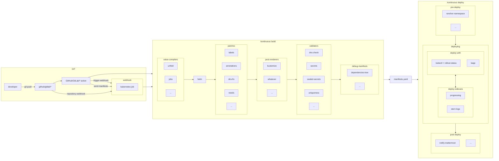

# Development

```sh
git clone git@github.com:socialgouv/kontinuous.git
cd kontinuous
yarn
```

Setup [global config as in doc example](./advanced/configuration.md#global-config); I attire your attention on the fact that you can override remote repo to local directory using `links` key.

to run tests:

```sh
### to run all tests
yarn test

### to run kontinuous cli tests
yarn test:kontinuous

### to run webhook tests
yarn test:webhook
```

To run manifests build command in repo:

```sh
cd /lab/fabrique/sre/template
/lab/fabrique/sre/kontinuous/packages/kontinuous/bin/kontinuous build -so -d
```

You can start to create new plugins or modify kontinous core (no, seriously, don't do that if you don't know what you're doing and you havent really try to find a way to accomplish your goal using plugin, theorically you'll can accomplish almost everything with plugins system).

## Releasing

### Automatic

Execute the [Trigger Release](https://github.com/socialgouv/kontinuous/actions/workflows/trigger-release.yml) workflow to trigger a new release of actions and helm charts.

### Manual

Releasing follow semantic versioning using [standard-version tool](https://github.com/conventional-changelog/standard-version). Versioning can be trigerred manually on dev machine to not block rapid iteration of master branch code : just run `yarn release` on master branch and CHANGELOG will be feeded with informations from commits using the conventionnal commit standard, then package will be bumped, as the charts versions and commited, then tagged. Then just follow cli instruction that say: `git push --follow-tags`. Then the action will publish automatically new version of npm cli, and charts index.

## Contributing (developments on kontinuous)

### Run locally

#### prepare kontinuous

```sh
git clone https://github.com/socialgouv/kontinuous.git
cd kontinuous
yarn install
```

#### kontinuous cli

```sh
cd ~/repos/my-project
~/repos/kontinuous/kontinuous --help
```

#### kontinuous webhook service

```sh
yarn dev:webhook
```

open your navigator on [http://localhost:7530/api/v1/swagger/](http://localhost:7530/api/v1/swagger/) to test the OpenAPI using the provided and awesome Swagger.

### Review branches

Kontinuous has many interconnected dependencies that make flow, it's can be hard to set version manually on each component, so there a great dev feature that it's called e2e-version. The default implementation target the major version that is linked on branch v1.

To create a review e2e linked branch of kontinuous and test it from end to end, you can just create a branch called `dev-**`, replacing `**` by a string containing only **lowercased alphanumerics** characters, `-` and `.`. Theses restriction are to be compliant with docker tagging rules.
On pushing this branch for the first time a workflow will make the link, and commit it to the branch. Then just pull the branch and continue to work on it. After each new push on the branch, wait for all related github actions to end before you can use last version of your branch on your testing implementation.

To create manually a review branch of kontinuous and test it from end to end, here is the process:

```sh
# prepare kontinuous
git clone https://github.com/socialgouv/kontinuous.git
cd kontinuous
yarn install

# create a new branch
git checkout -b feat/my-new-kontinuous-feature

# hardlink the branch version of kontinuous in the whole code
yarn version:e2e

# commit on branch
git commit -a -m "chore: temp set e2e version on the whole repo code"
```

Then work on you feature and publish branch. By doign so, you'll can use kontinuous github action suffixed by `@feat/my-new-kontinuous-feature` and you'll get full linked version, same for docker images (slugified) `:feat-my-new-kontinuous-feature`, and for kontinuous plugins.
From anywhere of your workflow you target version (branch or precise versioning), all the subsquent workflows will be linked to this version.

When you have finished to work on your feature branch, if you merge PR, the version you setted will be automatically replaced by the releasing process.
But if you want to do it manually for some reason (like merge branch yourself using git) you can do like this:

```sh
VERSION=$(node -e "process.stdout.write(JSON.parse(fs.readFileSync('package.json')).version)")
yarn version:e2e "v${VERSION}"
```

On webhook there is a query parameter that you can provide to select the tag of kontinuous docker image used for pipeline that is called `kontinuousVersion`, by setting it, locally, inside github action, or at repository settings level, you can target any version or feature branch you want.

### Test

all directories added to [packages/kontinuous/tests/samples](https://github.com/socialgouv/kontinuous/blob/master/packages/kontinuous/tests/samples) are like a `.kontinuous` directory in a project, it will be automatically tested when you will run `yarn test:kontinuous`. <br>
To run only one test at once you can run `yarn test:kontinuous -t name-of-my-test`. <br>
To upgrade snapshots run `yarn test:kontinuous -u`. <br>

### Contribute adding more Helm charts

New charts are welcome in folders [plugins/contrib/charts/](https://github.com/socialgouv/kontinuous/blob/master/plugins/contrib/charts/) (when universal) and [plugins/fabrique/charts/](https://github.com/socialgouv/kontinuous/blob/master/plugins/fabrique/charts/) (when more _La Fabrique_ opinionated, in doubt, purpose it here).
More options on existing charts will be carefully design, in case of doubt, or if you don't want to wait, you can hack everything using [post-renderer](#_45-bis-post-renderer) or [patches](#_45-patches) from your repository. Feel free, then give us feedback to ensure we follow best practices and are preserving project maintainability.

### Contribute adding more plugins

New patches are welcome in folder [plugins/contrib/patches/](https://github.com/socialgouv/kontinuous/blob/master/plugins/contrib/patches/). <br>
New validators are welcome in folder [plugins/contrib/validators/](https://github.com/socialgouv/kontinuous/blob/master/plugins/contrib/validators/). <br>
New jobs are welcome in folder [plugins/contrib/jobs/](https://github.com/socialgouv/kontinuous/blob/master/plugins/contrib/jobs/). <br>
New values-compilers are welcome in folder [plugins/contrib/values-compilers/](https://github.com/socialgouv/kontinuous/blob/master/plugins/contrib/values-compilers/). <br>
New pre-deploy are welcome in folder [plugins/contrib/pre-deploy/](https://github.com/socialgouv/kontinuous/blob/master/plugins/contrib/pre-deploy/). <br>
New post-deploy are welcome in folder [plugins/contrib/post-deploy/](https://github.com/socialgouv/kontinuous/blob/master/plugins/contrib/post-deploy/). <br>
New deploy-with are welcome in folder [plugins/contrib/deploy-with/](https://github.com/socialgouv/kontinuous/blob/master/plugins/contrib/deploy-with/). <br>
New deploy-sidecar are welcome in folder [plugins/contrib/deploy-sidecar/](https://github.com/socialgouv/kontinuous/blob/master/plugins/contrib/deploy-sidecar/). <br>
New extends are welcome in folder plugins/contrib/extends/. <br>

### _La Fabrique_ images CI build

**to build local docker image**

```sh
cd ~/repos/kontinuous

docker build -f packages/kontinuous/Dockerfile . -t kontinuous
```

**to run local docker image**

```sh
cd ~/repos/my-project

docker run \
  -t \
  -u $UID \
  -v $PWD:/workspace \
  -v $HOME/.kube:/home/ubuntu/.kube \
  kontinuous \
  --help
```

### Core Informations

#### A note on YAML

Kontinuous support retro-compatibility YAML syntax version 1.1, some chart, including the keycloak one need this. In old YAML syntax (1.1), octal can be converted to integer, for example octal `0555` is equal to integer `365`, in new YAML syntax (1.2) octal are considered as padded number, and it's not that do we want, because in this case octal `0555` is converted to integer `555` which is wrong. I don't know exact implementation of YAML in Helm, but current version of Helm v3 treat octal correctly, according to YAML 1.1 spec, and so, we can found charts that is compatible with Helm, but not compatible with new YAML syntax spec 1.2. In Kontinuous we need to parse `values.yaml` file including defaults one of charts that we merge in one global, so we need to support YAML 1.1 to be fully compliant with state of art.

#### Possibles ways to deployment

