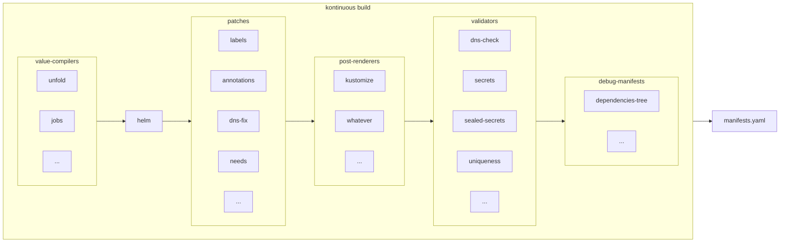

# kontinuous : GitOps for Kubernetes

## With kontinuous you can:

- 📦 Define applications resources definitions and their dependencies in GIT
- 🚧 Use common builtin jobs : docker builds, create-database...
- 🌍 Deploy on many environments : review-branches, preprod, prod...
- 🔐 Use GitHub, GitLab or your own machine to build and deploy; no vendor-lockin

kontinuous is built ontop of [HELM](https://helm.sh/), it's modular and plugin-based so you can extend it at will.

### Getting started

The CLI is fully documented, you can consult help using `npx kontinuous --help` to known all available commands. Consult help and availables options using `--help` on each command.

With `npx kontinuous init` you can bootstrap a new `.kontinuous` folder that will hold your application and environments definitions.

The `.kontinuous/values.yaml` is where you define your applications components, and they can be overriden in `.kontinuous/${env}/values.yaml`.

Every yaml file in `.kontinuous/templates` and `.kontinuous/${env}/templates` will be merged with the final manifests.

You'll find a detailed documentation below and plenty of examples in our [samples](https://github.com/socialgouv/kontinuous/packages/kontinuous/tests/samples).

#### Directory structure

```raw
.kontinuous
├─ config.yaml # kontinuous config, install and configure plugins
├─ values.yaml # common values passed to charts
├─ templates (optional) # common kubernetes resources defined as helm templates, can consume veriables defined in values
│   └─ * # any yaml file that you put here will be included in manifests
├─ env (optional)
│   ├─ dev
│   │   ├─ values.yaml # values override for dev environment
│   │   └─ templates # kubernetes resources specific for dev environment
│   │       └─ * # any yaml file that you put here will be included in manifests
│   ├─ preprod
│   │   ├─ # same as dev, but for preprod :)
│   │   └─ # if you have common templates with dev you can make relative symlink targeting dev resources to avoid repetition
│   ├─ prod
│   │   └─ # same as dev and preprod, but for prod :)
│   └─ local
│       └─ # same as dev and preprod and prod, but for local cluster, if you have a kubernetes cluster on your laptop :)
└─ charts (optional)
    └─ name-of-chart # you can override values for this chart in root values.yaml at key `name-of-chart`
        ├─ values.yaml # default values for the chart
        ├─ templates # same as before
        ├─ env # same as before
        └─ charts # if you have subcharts, you can nest infinitely
```

#### Build

Run `npx kontinuous build -o` to see your manifests and `npx kontinuous build -o | kubectl apply` to deploy to your cluster.

#### Environments

Environment can be provided using `KS_ENVIRONMENT` environment variable, `--env` option, or is autoselected from `.git`.

Env related `values.yaml` and templates directories will be merged from `.kontinuous/env/${env}`.

| Branche or tag | environnement |
| -------------- | ------------- |
| master, main   | preprod       |
| v\*.\*         | prod          |
| \*             | dev           |

### Requirements

[TODO]: on the cluster

Minimal dependencies:

- Git repository (public or private)
- Kubernetes
  - giving the kubeconfig to kontinuous to access the project scope
  - a dedicated ci namespace per project and per cluster containing all needed secrets (optional)

## Advanced

cf [full schema](https://mermaid.live/edit#pako:eNp9VE2PmzAQ_SvI14YogTQb0qqnVttK7aWtVKmwBwMTcGNs1x-bZTf73ztAEkhIqkjxzHjm-Xnm4ReSyRzImhSaqtL7-j0RiTAu7dz7Lz8TkTMNmWVS4O47dOERuFSgff_DvmDWU86UjVG6NBHdilu0LYnvmf3sUq_zHgb7ew1KGmalrv0dpKWU2_1hjX91q6eYAs4EYB2IvGE24HZIHvHbuhS0AAvG_yPTuHc9dHukE85WCsuEk87EvemljvH8YQR-VvlIuQM_k5ViHLQZJTuxkRwPw3Nx8ymeTqdXzlfUZiWMqzlNgWOYCiEtbeJNjjD-hj0lQgDk6Ne3QKWxvsYo6GvMts5YWbFnSMSupBYnqhPxfAMLr8lyioMa4zR0kHyGUzCQabCmMSiH3D_5TrC_DgQYtHc3jsghdYVfUcE2YOyVc0A1dxEZw6laDcj78RzqYhYosBJ4hcuhvY111hMM9BdDZ0RhoLnm1ykYE3uRDIJ7q1lR4DdxIeVhikG8_oA-42BcQPc2bpyqpjWteEfoPNbeQHFZX_S1CQ113UWwb0qDf6zo7RMME0Xb9s48du9YMJ7fRY2_w-_8_QnNNyyHjDYKGil1wENTgbPSvqAVGEUzHLP9n8CPdfiBsE2NvbUWdIU7qLqbSrvgo7QsNIqzJW-wXsTtv8dlYa4-PIMbxgP7oXt6Msvjw-q98bTkXDrrG_yCXQO3pUpdKCsRZEIqJE5Zjg_xSyI8LyG2hAoSskYzp3qbkES8Yp5TqFj4lDcPJ1lb7WBCqLPyRy0yst5QbuCY9JFRJFydotAWfeue-_bVnxBFBVm_kCey9her2TQKVkG4mM-iMAyjuwmpyXoeBtMgWobL-Wz5NooWYfA6Ic9SIu58GkazVbC4W4azaBmsVkEL-LvdbKi9_gPaEWbk)

### 2. Configuration

#### 2.1 Repository config

The repository config file path is `.kontinuous/config.yaml` and this file shoud be commited on the repo. No sensitive data should be included here.

sample for `.kontinuous/config.yaml` :

```yaml
projectName: my-project
dependencies:
  fabrique:
    import: socialgouv/kontinuous/plugins/fabrique

    valuesCompilers: {}
    patches: {}
    validators: {}
    preDeploy: {}
    postDeploy: {}
    deploySidecars: {}

    dependencies:
      contrib:
        patches:
          reloader:
            enabled: false
```

All plugin types, matching to folders naming, are camel-cased. All plugin names, matching to files naming, are camel-cased to and, if prefixed with numbers for simple auto-ordering, the number prefix will be removed. For example, to target the config of `plugins/contrib/values-compilers/06-global-defaults.js`, in case of `contrib` imported via `fabrique` plugin:

```yaml
dependencies:
  fabrique:
    dependencies:
      contrib:
        valuesCompilers:
          globalDefaults:
            enabled: true
            options:
              foo: bar
```

#### 2.2 Global config

The global config file path is `~/.kontinuous/config.yaml` where `~` is your `$HOME` path. You can configure specific environment for your workstation. This file can contain sensitive data as webhook token for projects.

The global config is merged as default config to your project config when running kontinuous.

All keys are same except `projects` and `organizations`:

- Subkeys of `projects` will be merged only when the key match with `projectName`.
- Subkeys of `organizations` will be merged only when the key match with `organization`, than can be defined at project config level or in `projects` of global config, like in the example.

sample for `~/.kontinuous/config.yaml` :

```yaml
links:
  # socialgouv/kontinuous: /home/jo/repositories/kontinuous # this will be configured by default on correct path when using kontinuous from cloned repo or inside docker image instead of npx's cli
  my-orga/my-repo-with-jobs-and-other-kontinuous-plugins: /home/jo/repositories/my-orga/my-repo-with-jobs-and-other-kontinuous-plugins

# organizations:
#   fabrique:

projects:
  my-project:
    # organization: fabrique
    webhookToken: "********************************"
```

##### 2.3 CLI config

CLI is fully documented, you can consult help using `npx kontinuous --help` to kown all available commands.
Consult help and avaiables options using `--help` on each command, for example to display help from build command run `npx kontinuous build --help`.

##### 2.4 Variables

Most of the configuration can be defined in 3 ways:

- config files (global, then by project)
- environment variables (override config file)
- command line options (override environment variables)

For exhaustive description of behavior you can [check the source code](https://github.com/socialgouv/kontinuous/blob/master/packages/common/config/load-config.js). <br>

### CI/CD With GitHub

[todo]

### CI/CD With GitLab

[todo]

## Internals and design principles

### 🐉 The paradigm

**_Why another CI/CD ?_**

We want a flexible, scalable and independent CI+CD framework, designed for kubernetes with fine grained control over pipelines.<br>
Kontinuous addresses all theses needs and, by using it's rich **_out-of-the-box_** plugins, it can addresses many more.

**_The approach_**

In a simple sentence: Kubernetes manifests as pipelines. <br>
What does that means ? <br>
All CI+CD pipelines are reproductible applying the built yaml manifests.

**_Philosophy_**

Keep as close as possible of battle tested and confident tech paradigms as native kubernetes and helm so we can use all theirs powers and abilities with features enrichment. <br>
CLI runnable from anywhere: CI runner (github, gitlab, ...), kubernetes job (creatable from webhook, itself trigerrable from git platform webhook feature, from another ci/cd pipeline or manually), even your own laptop.<br>
Everything are plugins. Especially opinions. So we keep modularity and we can switch between approach and tooling when needed. <br>

**_Main stack_**

[Helm](https://helm.sh/):
build manifests from helm templates, so kontinuous is interoperable the most popular package manager for kubernetes and can use the go templating language that is widely adopted in the kubernetes ecosystem <br>
[NodeJS](https://nodejs.org):
expose adapted and simplified logic to final dev users, with ready to use values system corresponding to infra, flexible patching system, easy to use plugin charts system etc...

## 🌀 Life Cycle

### 📝 build manifests

- load dependencies (from .kontinuous/config.yaml) ♾️ Git based extensible plugins ecosystem
- values-compilers (and values.final.js) plugins 🐒 Expose easy to use options you choose for your final developers
- helm template 🌟 Full access to rich helm ecosystem and fractal service definitions (subcharts)
- patches (and post-renderer) plugins 🎯 Highly Customizable (better than kustomize)
- validators plugins ✅ Verify compliance (opinionable)
- debug-manifests plugins 🐞 Tailor makable debugging

### 🚀 deploy manifests

- pre-deploy plugins
- deploy
  - deploy-with plugins
  - deploy-sidecars plugins
- post-deploy plugins

## ✨ Features

### ☯️ Core features

- run anywhere
- dependencies tree between jobs and deployment
- on file change switcher (exprerimental)
- patches manifests (using plugins)
- easy hack of manifest using [jq](https://stedolan.github.io/jq/) (using post-renderer)
- validate (using plugins)
- pre-deploy hook (using plugins)
- post-deploy hook (using plugins)
- plugins at repository level
- external plugins from git repo
- nested charts
- external helm charts
  - from helm repository
  - from git repository
- private repository (experimental)
- adaptable to your infra
- meta-values to patches even external charts (eg: using ~needs for dependencies tree)

### ♾️ Plugin's features

- values-compilers
  - auto matching on nested charts
  - multiple instances of chart
  - implicit enabled
  - global default values helpers
  - ...
- patches
  - auto set undefined to main namespace
  - auto set rancherProjectId from ci namespace
  - auto hash and truncate too long ingress subdomains with global replacement
  - needs as init containers (deployable with kubectl)
  - needs as kapp annotations (deployable with kaap)
  - ...
- validators
  - validate ingress subdomains compliance
  - verify sealed secret
  - no plain secret
  - resources uniqness
  - ...
- debug-manifests
  - resources tree infos
  - dependencies-tree-infos
  - ...
- pre-deploy plugins
  - ensure rancher namespaces are in active state
  - on demand resource cleaner
  - ...
- post-deploy plugins
  - notify mattermost (coming soon)
  - ...

### 3. Build manifests



##### 3.1 Values

Defaults values are loaded from charts `values.yaml` files

Values are merged from project paths:

- `.kontinuous/values.yaml` (optional)
- `.kontinuous/${env}/values.yaml` (optional)
- `.kontinuous/values.js` (optional)

Then `values-compilers`, and optionaly `values.final.js`, will modify the values. See also [official plugins](#_47-official-plugins).

Some values can contain templating and use others values variables, but only if `tpl` Helm function is used to load value in Helm templates.

**dot notation values (shortcut syntax)**

by prefixing a value with dot character `.`, you can use dot notation to set values, like

```yaml
.a.nested.value: foobar
```

will be resolved to

```yaml
a:
  nested:
    value: foobar
```

###### meta-values

A meta-value is a value that will not be consumed by the chart directly, but extends the capacity of the chart to be modified at patching time according to values parameters provided by final dev user.

Meta-values are handled by the plugin contrib/patches/valuesPatches.

**meta-values plugin**

the prefix `~` will patch all manifests generated by the chart with kontinuous plugin annotation, so you'll can treat them with patches, example, "~needs: [test]"

```yaml
metadata:
  annotations:
    kontinuous/plugin.needs: [test]
```

meta-value `~chart` used to create an instance of a specific chart

```yaml
arbitrary-chart-instance-name:
  ~chart: app
```

example with fully qualified target

```yaml
arbitrary-chart-instance-name:
  ~chart: project.fabrique.contrib.app
```

`project` is a always the root chart name, matching repository level, `fabrique` is a kontinuous umbrella plugin that you can import, and `contrib` is a plugin that is imported by `fabrique`, `app` is the chart name.

**meta-values set**

```
chartName:
  ~.metadata.annotation.foo: bar
```

the prefix `~.` will patch all manifests generated by the chart with the dot notation syntax

##### 3.4 Templates

Every yaml file in `.kontinuous/templates` and `.kontinuous/${env}/templates` will be merged with the helm Chart `templates` folder before the build.

All theses files can use the Helm templating syntax (or not if you don't need it, helm template is a superset of yaml).

Both extensions yaml and yml are accepted.

Usually, that's where you put your CronJob, ConfigMap and SealedSecret ressources.

##### 3.5 A note on YAML

Kontinuous support retro-compatibility YAML syntax version 1.1, some chart, including the keycloak one need this. In old YAML syntax (1.1), octal can be converted to integer, for example octal `0555` is equal to integer `365`, in new YAML syntax (1.2) octal are considered as padded number, and it's not that do we want, because in this case octal `0555` is converted to integer `555` which is wrong. I don't know exact implementation of YAML in Helm, but current version of Helm v3 treat octal correctly, according to YAML 1.1 spec, and so, we can found charts that is compatible with Helm, but not compatible with new YAML syntax spec 1.2. In Kontinuous we need to parse `values.yaml` file including defaults one of charts that we merge in one global, so we need to support YAML 1.1 to be fully compliant with state of art.

### 4. Plugins

**Core**

The core is responsible to merge config, values, templates and process plugins, most of the logic is delegated to plugins. The core is also responsible of tree directory structure creation in temporary folder, yarn install when needed, then helm template calling.

**Plugins**

All custom logic can be implemented in plugins. By creating plugins you can covers all uses cases.

#### 4.1 types

There are differents type of plugins:

- values-compilers: transform user defined values to be consummed by charts
- charts: it's basically all helm charts, you can import from helm repository or declare your own in git repository
- patches: patches applies to final generated kubernetes manifests
- post-renderer: applies to final generated kubernetes manifests after patches, it's like a final super patch, usually used to hack the manifests at project level using dirty bash and jq
- validators: make custom conformity checks on final generated kubernetes manifests
- debug-manifests: used to display various informations extracted from manifests as dependencies tree
- pre-deploy: as it's name indicate, will be run before deploy, it can create pre-requisite resources and wait for state
- deploy-with: plugin as a deployment handler (kapp, kubectl, helm)
- deploy-sidecar: plugin that is running in parallel of deployment handler, used to retrieve logs, fail fast, monitoring some things etc...
- post-deploy: used, for example, to make a report of deployment by sending a message to a third party service
- kontinuous umbrella plugin: you can combine multiples plugins in one repository, or directory inside a repository, using kontinuous umbrella plugins. You can call theses plugins by defining `dependencies` in `.kontinuous/config.yaml` file, calling them with the `import` keyword.

**auto import behavior**

All plugins follow a recursive design pattern, imported umbrella plugins can import another repo (example project import fabrique, fabrique import contrib etc...), all charts can have subcharts, that can have subchart etc..., it the same for values-compilers, patches, validators, debug-manifests, pre-deploy, post-deploy and deploy-sidecar.
When you import recursively there is an arborescence autobuild.
An umbrella plugin contain generally a `kontinuous.yaml` that will contain specific options on sub plugins and sub importeds umbrella plugins, you can ovveride theses in `.kontinuous/config.yaml` at the root of the repository.

**degit**

Remote plugin can be integrated using [`degit`](https://github.com/tiged/tiged) mechanism. You can target full git url on any git plateform, shortcut syntax will default to github. If you use gitlab, there is an addon on `degit` syntax in kontinuous that you can use to target subgroup, putting curly braces arround group name: `https://gitlab.my-orga.com/group/{subgroup-name}/repo/folder/subfolder@ref-branch-or-tag`

**config plugins**

A plugin can be parametred using `enabled` and `options` keys.

The `enabled` key as it's name indicating, allow you to enable or disable a plugins. All plugins are enabled by default, but can be disabled by default at same level as `import` keyword in `kontinuous.yaml` config file.

The `options` key allow you to pass any options that you want to the plugin, and will be consumed by it.

```yaml
projectName: my-project
dependencies:
  fabrique:
    import: socialgouv/kontinuous/plugins/fabrique
    valuesCompilers:
      globalDefaults:
        enabled: true
        options:
          foo: bar
```

You can also add global options, common to your umbrella plugin.

`plugins/fabrique/kontinuous.yaml`

```yaml
dependencies:
  contrib:
    import: socialgouv/kontinuous/plugins/contrib
options:
  domain: "fabrique.social.gouv.fr"
```

The `domain` option will be provided to all plugin as default merge, but you can override at each plugin level:

```yaml
dependencies:
  contrib:
    import: socialgouv/kontinuous/plugins/contrib
    valuesCompilers:
      globalDefaults:
        enabled: true
        options:
          foo: bar
          domain: "override.social.gouv.fr"
options:
  domain: "fabrique.social.gouv.fr"
```

#### 4.2 umbrella

An umbrella plugin is the container for all other plugins types. It's basically a git repository, or subdirectory of a git repository. It can be versioned as a git repo. <br>
A umbrella plugin can import other umbrella plugins, dependencies are recursives. <br>
You can import umbrella plugins from `.kontinuous/config.yaml` in your project and in `kontinous.yaml` in the plugin directory. <br>
You have to name the umbrella from the plugin caller using key. This name will be used for subchart values autolinking. <br>

example:

`$PROJECT_WORKSPACE/.kontinuous/config.yaml`

```yaml
dependencies:
  fabrique:
    import: socialgouv/kontinuous/plugins/fabrique

    valuesCompilers:
      globalDefaults:
        options:
          foo: bar
    patches: {}
    validators: {}
    preDeploy: {}
    postDeploy: {}
    deploySidecars: {}

    dependencies:
      contrib:
        patches:
          reloader:
            enabled: false
        deployWith:
          kapp:
            options:
              kubeApiQps: 1000
              kubeApiBurst: 1000
              waitCheckInterval: 1s
              logsAll: true
```

`socialgouv/plugins/fabrique/kontinuous.yaml`

```yaml
dependencies:
  contrib:
    import: socialgouv/kontinuous/plugins/contrib
```

`$PROJECT_WORKSPACE/.kontinuous/values.yaml`

```yaml
fabrique:
  contrib:
    someChart:
      aValueToBeConsumedByAppSomeChartOfContribPlugin: Hello World !
```

All plugins `charts`, `values-compilers`, `patches`, `validators`, `debug-manifests`, `pre-deploy`, `post-deploy` and `deploy-sidecar` will be autolinked and implicitely applied recursively. You can control order, or optout by creating index.js in each `values-compilers`, `patches`, `validators`, `debug-manifests`, `pre-deploy`, `post-deploy`, `deploy-sidecar` and `deploy-with` directories, then you can include from dependencies plugins yourself. <br>
See [plugins/fabrique/values-compilers/index.js](https://github.com/socialgouv/kontinuous/blob/master/plugins/fabrique/values-compilers/index.js) for example.

You can create and use `charts`, `values-compilers`, `patches`, `validators`, `debug-manifests`, `pre-deploy`, `post-deploy` and `deploy-sidecar` directories in `.kontinuous` at project level in your project path, or in plugin root path. Project level plugins can consume plugins in the same way the plugins can consume other plugins.

You can add a `package.json` and a `yarn.lock` file at root of your kontinuous plugin directory, kontinuous will install it using `yarn` (yes, it's opinionated), so you can use node dependencies in your `values-compilers`, `patches`, `validators`, `debug-manifests`, `pre-deploy`, `post-deploy`, `deploy-sidecar` and `deploy-with` plugins.

#### 4.3 charts

Charts plugin are basically helm charts, that can be autolinked from the umbrella (name for the main chart in helm jargon). <br>
If you doesn't create a `Chart.yaml` in a chart repository, a default on will be created for you by kontinuous. <br>
A parent chart will be automatically created from project/plugin path, charts that are present in the `charts` directory will be automatically added to this chart as subcharts (`dependencies` key in `Chart.yaml`). <br>

#### 4.4 values-compilers

As it's name suggest it, it's values compilers, that will transform values declared in `values.yaml` files in final values that will be consumed by `helm`. <br>
Most often values-compilers are here to make values leaner to declare for final dev user. <br>
Values compilers are pure nodeJS file that have to export commonJS function that will receive values object and has to return values object or undefined. Returned values object will be used if returned, else you can mutate values object directly. <br>
Here are the args that the function will receive: `module.exports = (values, options, { config, utils, ctx, getOptions, getScope }) => values` <br>

- `values` is the values object
- `options` is the options that can be defined at plugin/project level, eg:
  `$PROJECT_WORKSPACE/.kontinuous/values.yaml`
  ```yaml
  dependencies:
    fabrique:
      import: socialgouv/kontinuous/plugins/fabrique
      valuesCompilers:
        globalDefaults:
          options:
            foo: bar
  ```
- `config` is the current [kontinuous config](#_25-variables)
- `utils` is a toolset of helpers function used in kontinuous itself and exposed, all are defined here: [packages/common/utils](https://github.com/socialgouv/kontinuous/blob/master/packages/common/utils)
- `ctx` is the async context dependency injection container of kontinous, it can be used to retrieve config or logger, eg: `logger = ctx.get("logger")`

#### 4.4-bis values.js

Instead or additionaly to using a `values.yaml`, you can use a project level only values compiler, that will be runned before all others (bu after retrieving and merging values from `values.yaml` files), creating a values.js file.

#### 4.5 patches

Patches are pure nodeJS file used to modify final `manifests` after compiled by `helm template`. <br>
Same as `values-compilers` and `validators`, patches has to expose a function using commonJS. This function will receive the kubernetes manifests as an array of object that you can mutate directly or use to produce a new one that you will return. <br>
Here are the args that the function will receive: `module.exports = (values, options, { config, utils, ctx, logger, values, getOptions, getScope }) => values` <br>
See [values-compilers doc for details on arguments](#_44-values-compilers)

NodeJS patches are more flexible than `kustomize` patches that had be abandonned for following reasons:

- https://github.com/kubernetes-sigs/kustomize/issues/947
- https://github.com/kubernetes-sigs/kustomize/issues/1493

If you want to use `kustomize` anyway, the easiest way is to use [`post-renderer`](#_45-bis-post-renderer)

#### 4.5-bis post-renderer

Aka _Hack the manifests_

By creating an executable file called `post-renderer` in `.kontinuous` directory at project level, you can declare an helm post-renderer. So you can modify your manifest easily using [`jq`](https://stedolan.github.io/jq/) Eg:

```sh
###!/bin/sh

set -e

### load into variable from standard input
manifest=$(cat)<&0

### arbitrary modify some stuf
manifest=`echo "$manifest" | jq 'map(select(.kind == "Namespace").metadata.labels.foo = "bar")'`

### output
echo "$manifest"
```

Or if you want to use kustomize (not recommended for reasons explained in [patches documentation chapter](#_45-patches))

```sh
###!/bin/sh
manifest=$(cat)<&0
echo "$manifest" > base.yaml
kustomize build .
```

#### 4.6 validators

Validators are pure nodeJS file used to validate final `manifests` after compiled by `helm template`. <br>
Same as `values-compilers` and `patches`, validators has to expose a function using commonJS. This function will receive the kubernetes manifests as an array of object. <br>
When a manifest contain an invalid definition you have to throw an error this way `throw new Error("error message")`.

Here are the args that the function will receive: `module.exports = (manifests, options, { values, config, utils, ctx, logger, getOptions, getScope }) => {}` <br>
See [values-compilers doc for details on arguments](#_44-values-compilers)

#### 4.7 official plugins

Official plugins are here [plugins/contrib/](https://github.com/socialgouv/kontinuous/blob/master/plugins/contrib/). They could be put in another git repository, but was kept in main repository for testing purpose.

- **[contrib](https://github.com/socialgouv/kontinuous/blob/master/plugins/contrib/)**

  - [charts/jobs](https://github.com/socialgouv/kontinuous/blob/master/plugins/contrib/charts/jobs) <br>
    generic kubernetes jobs chart, used for easily declare CI pipelines from values <br>
    _it require [values-compilers/jobs](https://github.com/socialgouv/kontinuous/blob/master/plugins/contrib/values-compilers/jobs.js)_

    example `.kontinuous/values.yaml`:

    ```yaml
    hasura:
      needs: [db]

    jobs:
      runs:
        db:
          # use: ./.kontinous/jobs/create-db # local job, defined in project repository
          # use: https://github.com/socialgouv/kontinuous/plugins/contrib/jobs/create-db # degit full url
          use: socialgouv/kontinuous/plugins/contrib/jobs/create-db # degit implicit github
          with:
            pgAdminSecretRefName: pg-scaleway
        seed:
          needs: [hasura]
          use: socialgouv/kontinuous/plugins/contrib/jobs/seed-db
          with:
            seedPath: path/in/repo.sql
    ```

    see [plugins/contrib/jobs/create-db/use.yaml](https://github.com/socialgouv/kontinuous/blob/master/plugins/contrib/jobs/create-db/use.yaml) for full example.
    All vues from `runs` keys will be interpolated in the job, but you can also uses all parameters directly, except the `with` parameter that is reserved to be used with `use` and inject variable to the called job.

    All others components can declare dependencies on jobs using the `needs` key, and all jobs can declare depencencies on other jobs and other components too, using instances names.

    Mains jobs parameters are:

    - `use` and `with`: to include job definition from elsewhere, usage can be recursive (job can use job, that can use job etc...)
    - `image` the docker image file that will run the job (default is debian for now, in future this will be a generic image with almost all needed tooling)
    - `action` repository (or subfolder in a repository) that will be degitted in mountpoint `/action/` in the job execition
    - `run` a custom command that will override docker image default run, can be a full bash script or just a call to a command
    - `checkout` (default `true`), this enable the degit of the repository at current commit in mountpoint `/workspace/` in the job
    - `if` condition to include the job, can contain variables from values

  - [charts/kontinuous-helpers](https://github.com/socialgouv/kontinuous/blob/master/plugins/contrib/charts/kontinuous-helpers) <br>
    common helm [library chart](https://helm.sh/docs/topics/library_charts/), contains helpers helm templating snippets that can be reused in any subchart, helping you to keep your charts DRY

  - [patches/namespace](https://github.com/socialgouv/kontinuous/blob/master/plugins/contrib/patches/namespace.js) <br>
    Add the current kubernetes namespace from [kontinuous config](#_24-variables) to all manifests that doesn't declare explicitly a namespace

  - [patches/dns-truncate](https://github.com/socialgouv/kontinuous/blob/master/plugins/contrib/patches/dns-truncate.js) <br>
    Truncate and hash all manifests name and ingress domains that is over the max allowed 63 characters.

  - [patches/kapp](https://github.com/socialgouv/kontinuous/blob/master/plugins/contrib/patches/kapp.js) <br>
    Add `fallback-on-update` and `fallback-on-replace` update and create strategies, and `disable-original` to fix kapp issue [#472](https://github.com/vmware-tanzu/carvel-kapp/issues/472)

  - [validators/dns-limit](https://github.com/socialgouv/kontinuous/blob/master/plugins/contrib/validators/dns-limit.js) <br>
    Check that all manifests name and ingress domains is not over the max allowed 63 characters. This should never fail if you use [patches/dns-truncate](https://github.com/socialgouv/kontinuous/blob/master/plugins/contrib/patches/dns-truncate.js).

  - [validators/needs](https://github.com/socialgouv/kontinuous/blob/master/plugins/contrib/validators/needs.js) <br>
    Check that there is no delcared as required resource that doesn't exists in the manifests.

  - [validators/resources-uniqness](https://github.com/socialgouv/kontinuous/blob/master/plugins/contrib/validators/resources-uniqness.js) <br>
    Check that there is no duplicate resource name for the same kind.

  - [values-compilers/dash-instances](https://github.com/socialgouv/kontinuous/blob/master/plugins/contrib/values-compilers/dash-instances.js) <br>
    Compile values key at root level that start with existing chart name, including dependencies chart name, as `${chartName}-arbitrary-instance-name`, to make a chart alias and implement an instance the chart.

    You can declare as many instances as you want of a chart, the name must start with the chart's name suffixed by `-`, eg:

    ```yaml
    app:
      host: ozensemble.fr
      redirectFrom:
        - "{{ .Values.global.host }}"
        - www.ozensemble.fr

    app-2nd-instance:
      probesPath: /healthz
      envFrom:
        - secretRef:
            name: "{{ .Values.global.pgSecretName }}"
        - secretRef:
            name: app-sealed-secret
        - configMapRef:
            name: app-configmap
    ```

    This is an equivalent to adding `~chart` meta-value:

    ```yaml
    app-2nd-instance:
      # ~chart: app # implicit because name starts with app-
    ```

    ```yaml
    arbitrary-chart-instance-name:
      ~chart: app
    ```

  - [values-compilers/unfold-charts](https://github.com/socialgouv/kontinuous/blob/master/plugins/contrib/values-compilers/unfold-charts.js) <br>
    Refacto the value tree on the fly matching the root level key name with dependencies subcharts names. Example, if you import `fabrique` umbrella plugin in your project: <br>
    `.kontinous/values.yaml`

    ```yaml
    app: {}
    ```

    will be compiled into: <br>

    ```yaml
    fabrique:
      app: {}
    ```

    And if you use `jobs` chart values key of `contrib` plugin that is imported by `fabrique` plugin: <br>
    `.kontinous/values.yaml`

    ```yaml
    jobs: {}
    ```

    will be compiled in: <br>

    ```yaml
    fabrique:
      contrib:
        jobs: {}
    ```

    And so, on helm template compilation run, the values of jobs can be consumed by `jobs` chart, that is a subchart of `contrib`, that is itself a subchart of `fabrique`. FYI helm subcharts are natively recursive.

  - [values-compilers/implicit-enabled](https://github.com/socialgouv/kontinuous/blob/master/plugins/contrib/values-compilers/implicit-enabled.js) <br>
    Compile declared charts's values to implicit set `enabled` to `true`.

  - [values-compilers/jobs](https://github.com/socialgouv/kontinuous/blob/master/plugins/contrib/values-compilers/jobs.js) <br>
    Compile jobs simple values to be used by final chart, it includes the downloading of reusable `jobs` (using the `use` keyword) and merging of values from the imported job.

- **[fabrique](https://github.com/socialgouv/kontinuous/blob/master/plugins/fabrique/)**

  - [charts/rancher-namespace](https://github.com/socialgouv/kontinuous/blob/master/plugins/fabrique/charts/rancher-namespace) <br>
    add a namespace configured with provided with rancherProjectId for [rancher](https://rancher.com/) right management. Enabled by default when `chart` kontinuous config is not provided.

  - [charts/security-policies](https://github.com/socialgouv/kontinuous/blob/master/plugins/fabrique/charts/security-policies) <br>
    add some default kube security policies. Enabled by default when `chart` kontinuous config is not provided.

  - [charts/app](https://github.com/socialgouv/kontinuous/blob/master/plugins/fabrique/charts/app) <br>
    Generic chart that can be used to deploy differents apps targeting a docker image, as frontend, backend etc...
  - [charts/hasura](https://github.com/socialgouv/kontinuous/blob/master/plugins/fabrique/charts/hasura) <br>
    deploy an instance of [hasura](https://hasura.io/)

  - [charts/pgweb](https://github.com/socialgouv/kontinuous/blob/master/plugins/fabrique/charts/pgweb) <br>
    deploy an instance of [pgweb](https://github.com/sosedoff/pgweb)

  - [charts/maildev](https://github.com/socialgouv/kontinuous/blob/master/plugins/fabrique/charts/maildev) <br>
    deploy an instance of [maildev](https://github.com/maildev/maildev)

  - [charts/metabase](https://github.com/socialgouv/kontinuous/blob/master/plugins/fabrique/charts/metabase) <br>
    deploy an instance of [metabase](https://www.metabase.com/)

  - [charts/oauth2-proxy](https://github.com/socialgouv/kontinuous/blob/master/plugins/fabrique/charts/oauth2-proxy) <br>
    deploy an instance of [oauth2-proxy](https://github.com/oauth2-proxy/oauth2-proxy)

  - [charts/redis](https://github.com/socialgouv/kontinuous/blob/master/plugins/fabrique/charts/redis) <br>
    deploy an instance of [redis](https://redis.io/)
  - [patches/cert-letsencrypt-issuer](https://github.com/socialgouv/kontinuous/blob/master/plugins/fabrique/patches/cert-letsencrypt-issuer.js) <br>
    add annotation to use `letsencrypt-prod` cluster-issuer using `cert-manager` on `ingress` to prod manifests.

  - [patches/cert-wildcard](https://github.com/socialgouv/kontinuous/blob/master/plugins/fabrique/patches/cert-wildcard.js) <br>
    add label `cert: "wildcard"` on main namespace so `kubed` will copy wildcard cert on dev environment namespaces.

  - [patches/rancher-project-id](https://github.com/socialgouv/kontinuous/blob/master/plugins/fabrique/patches/rancher-project-id.js) <br>
    if namespace containing an empty `field.cattle.io/projectId` annotation, and `ciNamespace` config is defined (usually when `deploy` command is used), it will try to retrieve rancher project id from the `ciNamespace` to fill it.
  - [values-compilers/global-defaults](https://github.com/socialgouv/kontinuous/blob/master/plugins/fabrique/values-compilers/global-defaults.js) <br>
    All defaults values for **_La Fabrique_** are defined here.
    Here is available global values that you can consume in every charts's templates:

    - certSecretName
    - repository
    - repositoryName
    - isDev
    - isProd
    - isPreProd
    - ttl
    - namespace
    - rancherProjectId
    - pgSecretName
    - pgDatabase
    - pgUser
    - host
    - domain
    - registry
    - imageProject
    - imageRepository
    - imageTag
    - branchSlug
    - branchSlug32
    - gitBranch
    - ciNamespace
    - sha
    - shortSha
    - env

  - [jobs/build](https://github.com/socialgouv/kontinuous/blob/master/plugins/contrib/jobs/build) <br>
    Build `docker` image from project Dockerfile and directory using `kaniko`.

  - [jobs/create-db](https://github.com/socialgouv/kontinuous/blob/master/plugins/contrib/jobs/create-db) <br>
    Create DB and associated new user for review branches using pg admin user.

  - [jobs/drop-db](https://github.com/socialgouv/kontinuous/blob/master/plugins/contrib/jobs/drop-db) <br>
    Drop a DB using pg admin user. Can be used before create-db to keep a pristine db on review branch.

  - [jobs/pg-restore](https://github.com/socialgouv/kontinuous/blob/master/plugins/contrib/jobs/pg-restore) <br>
    Restore a DB from backup using pg_restore.

  - [jobs/psql](https://github.com/socialgouv/kontinuous/blob/master/plugins/contrib/jobs/psql) <br>
    Run a sql file on DB from project repository.

  - [jobs/seed-db](https://github.com/socialgouv/kontinuous/blob/master/plugins/contrib/jobs/seed-db) <br>
    Run a sql file on DB from project repository using pg secret from target namespace.

### 5. Samples

There are many sample here [packages/kontinuous/tests/samples](https://github.com/socialgouv/kontinuous/blob/master/packages/kontinuous/tests/samples). <br>
Except in case there is a `.kontinuous` file here, the directories are assumed to be the `.kontinuous` dir of projects. The `.env` files are only consumed in tests and will be ignored by kontinuous in real build and deployments.

More samples will be added on demand when feedback for this current documentation will reveal that it's not easy to find and understand how to do a thing. Don't hesitate to ask for enrichment of this section 😉.

### 6. Deploy

#### 6.1. CLI

Run `npx kontinuous deploy` from your project repository. Depending of your infra, you will need to pass options as `--ci-namespace <ns>` (needed at **_La Fabrique_** for example).

for help call:
`npx kontinuous deploy --help`

You can also generate the manifests and then deploy it using [carvel/kapp](https://carvel.dev/kapp/)

```sh
npx kontinuous build -o > /tmp/manifests.yaml

kapp deploy /tmp/manifests.yaml
  --app label:kontinuous/kapp=name-of-my-app \
  --logs-all \
  --dangerous-override-ownership-of-existing-resources \
  -f /tmp/manifests.yaml
```

#### 6.2. Github Actions

- Option 1: **webhook + github logs** (the recommended one)

  CI/CD pipeline are triggered using the [webhook service](#_63-using-webhook-service) and the github CI is only responsible of deployment logging and manifests artifact retrieving and publishing. Retrying an action is trigerring a new pipeline using the webhook endpoint 😉. <br>
  To do this way you have to configure the [webhook service](#_63-using-webhook-service) first, then, if you want to use github (no obligation), you can implement it as [reusable workflow](.github/workflows/workflow-logs.yaml) or [composite action](logs/action.yaml):

  reusable workflow (the recommended one):

  ```yaml
  jobs:
    follow-deployment:
      uses: socialgouv/kontinuous/.github/workflows/workflow-webhook.yaml@v1
      secrets: inherit
  ```

  It require to configure the webhook on `push`+`create` and `delete` events at repository level on the git platform. On rerun, the action will trigger the webhook itself.

  reusable workflow without using webhook feature of git platform:

  ```yaml
  jobs:
    follow-deployment:
      uses: socialgouv/kontinuous/.github/workflows/workflow-webhook.yaml@v1
      secrets: inherit
      triggerWebhook: true
  ```

  With the option `triggerWebhook`, the action will trigger webhook pipeline on first run, if not provided, it will expect that webhook feature has allready triggered webhook pipeline and try to catch it on the fly.

  composite action:

  ```yaml
  jobs:
    logs:
      name: logs
      runs-on: ubuntu-latest
      steps:
      - name: kontinuous pipeline
          uses: socialgouv/kontinuous/webhook@v1
          with:
            token: ${{ secrets.GITHUB_TOKEN }}
            webhookToken: ${{ secrets.KUBEWEBHOOK_TOKEN }}
            webhookUri: https://webhook-${{ secrets.RANCHER_PROJECT_NAME }}.fabrique.social.gouv.fr
            # triggerWebhook: true # uncomment this line to use trigger only by action, without using webhook trigger feature on git platform at repository config level
  ```

- Option 2: **rely on Github CI**:

  You can deploy using github actions, running kontinuous deploy in the github CI

  ```yaml
  jobs:
    deploy:
      name: deploy
      runs-on: ubuntu-latest
      steps:
      - name: kontinuous pipeline
          uses: socialgouv/kontinuous/gh-actions/deploy-via-github@v1
          with:
            token: ${{ secrets.GITHUB_TOKEN }}
            kubeconfig: ${{ secrets.KUBECONFIG }}
            rancherProjectId: ${{ secrets.RANCHER_PROJECT_ID }}
            rancherProjectName: ${{ secrets.RANCHER_PROJECT_NAME }}
  ```

- Option 3: **manual workflow action deployed via webhook**:

  If you want to deploy custom action manifests via webhook you can use flag `--on-webhook`/`-w` like

  ```sh
  npx kontinuous deploy --chart my-custom-action --on-webhook
  ```

  values.yaml

  ```yaml
  my-custom-action:
    enabled: false # so it will not be enabled by default on classical deployment task, but only on demand in a trigger workflow using `--chart my-custom-action`
  ```

  And naturally, you can put helm templates here: `.kontinuous/my-custom-action/template`

#### 6.3. using webhook service

Using the webhook service you can be totally independent and self-hosted for running you CI/CD workflow.
The service can be deployed using an [official Helm chart](https://github.com/socialgouv/kontinuous/blob/master/packages/webhook/Chart.yaml).

[](https://excalidraw.com/#json=OoAm9RLHobXlWw9DmzC6x,R0CXD2-2gYj8D-9OvJS3GA)

##### 6.3.1. deploy webhook

###### 6.3.1.1. using Helm

It require you have predefined these secrets (in the namespace `myproject-ci` in example): <br>

- kubeconfig-dev
- kubeconfig-prod
- kubewebhook

_You can replace secrets names using values key `secretRefNames`._

Secrets should contains following environment variables:

- `KUBEWEBHOOK_TOKEN`
- `KUBECONFIG` and/or `KUBECONFIG_DEV`+`KUBECONFIG_PROD`,

To see all avaiables values and defaults see [packages/webhook/values.yaml](https://github.com/socialgouv/kontinuous/blob/master/packages/webhook/values.yaml).

```sh
npx -y tiged socialgouv/kontinuous/packages/webhook@master kontinuous-webhook

cd ./kontinuous-webhook

helm template .  \
    --set ciNamespace=myproject-ci \
    --set host=webhook-myproject.fabrique.social.gouv.fr \
    > manifests.yaml

kubectl --namespace myproject-ci apply manifests.yaml
```

###### 6.3.1.2. using ArgoCD

Here is a sample of an [ArgoCD ApplicationSet](https://argo-cd.readthedocs.io/en/stable/roadmap/#applicationset): [plugins/fabrique/samples/argocd/kontinuous-webhooks.yaml](https://github.com/socialgouv/kontinuous/blob/master/plugins/fabrique/samples/argocd/kontinuous-webhooks.yaml)

##### 6.3.2. configure webhook on repository

You should configure webhook event on push event on repository (from github, gitlab (should be tested), gitea (should be dev))

###### 6.3.2.1. Github

In the github repository, go to **settings** -> **Webhooks** -> **Add webhook**

in _Payload URL_ field put the endpoint: https://webhook-myproject.fabrique.social.gouv.fr/api/v1/oas/hooks/github?event=pushed

In _Which events would you like to trigger this webhook?_
select "Just the push event".

Check the _Active_ checkbox.

Then click to _Add webhook_ and you're good for **dev** env.

For **prod**, do the same but replace endpoint by: https://webhook-myproject.fabrique.social.gouv.fr/api/v1/oas/hooks/github?event=created <br>
and after selecting _Let me select individual events_, ensure you have all unchecked (uncheck _push_ event that is generally checked by default) and check _Branch or tag creation_

If you have to configure for many repo and you want to make it automatically and _infra as code_, here is a terraform snippet sample: [plugins/fabrique/samples/terraform/rancher-config-setup/github.tf](https://github.com/socialgouv/kontinuous/blob/master/plugins/fabrique/samples/terraform/rancher-config-setup/github.tf)

### 7. Development

see [CONTRIBUTING.md](../CONTRIBUTING.md)

### 8. Links

#### Developers resources

**helm templates**

to enable correct syntax recognition and coloration of yaml helm templates in vscode/[vscodium](https://vscodium.com/), enable [Kubernetes extension](https://marketplace.visualstudio.com/items?itemName=ms-kubernetes-tools.vscode-kubernetes-tools)

**learning**:

- [Learn YAML in Y minutes](https://learnxinyminutes.com/docs/yaml/)
- [Yaml is a superset of json](https://helm.sh/docs/chart_template_guide/yaml_techniques/#yaml-is-a-superset-of-json)
- [JSON to YAML](https://www.json2yaml.com/)
- [Kubernetes doc](https://kubernetes.io/docs/concepts/)
- [Helm doc](https://helm.sh/docs/)
- [Container training](https://container.training/)
- [A visual guide on troubleshooting Kubernetes deployments](https://learnk8s.io/troubleshooting-deployments)

#### Related projects

- https://github.com/Praqma/helmsman
- https://dagger.io
- https://github.com/csweichel/werft
- [https://github.com/ligurio/awesome-ci](https://github.com/ligurio/awesome-ci)
- [https://en.wikipedia.org/wiki/Comparison_of_continuous_integration_software](https://en.wikipedia.org/wiki/Comparison_of_continuous_integration_software)
