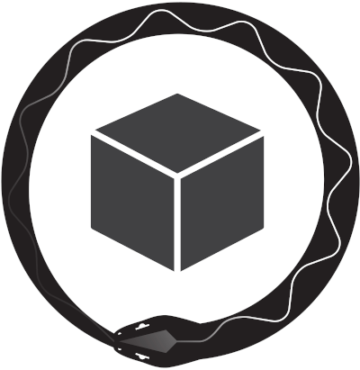

# Kontinuous

  

    GitOps for Kubernetes
  

  

    <a style="font-size:15px;" href="https://socialgouv.github.io/" target="_blank">
        

          coded with 💙🤍❤️
          by SocialGouv
        

        

          
        

      

    </a>
  

 

[🏁 Getting Started](#getting-started)
[👨‍💻 Ask for help](https://github.com/socialgouv/kontinuous/issues/new/choose)

