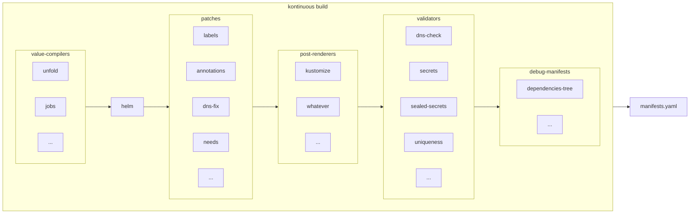

# kontinuous build



## Values

Defaults values are loaded from charts `values.yaml` files

Values are merged from project paths:

- `.kontinuous/values.yaml` (optional)
- `.kontinuous/${env}/values.yaml` (optional)
- `.kontinuous/values.js` (optional)

Then `values-compilers`, and optionaly `values.final.js`, will modify the values. See also [official plugins](#_47-official-plugins).

Some values can contain templating and use others values variables, but only if `tpl` Helm function is used to load value in Helm templates.

**dot notation values (shortcut syntax)**

by prefixing a value with dot character `.`, you can use dot notation to set values, like

```yaml
.a.nested.value: foobar
```

will be resolved to

```yaml
a:
  nested:
    value: foobar
```

## meta-values

A meta-value is a value that will not be consumed by the chart directly, but extends the capacity of the chart to be modified at patching time according to values parameters provided by final dev user.

Meta-values are handled by the plugin contrib/patches/valuesPatches.

### meta-values plugins

the prefix `~` will patch all manifests generated by the chart with kontinuous plugin annotation, so you'll can treat them with patches, example, "~needs: [test]"

```yaml
metadata:
  annotations:
    kontinuous/plugin.needs: [test]
```

### meta-values plugin needs

The meta-value `~needs` is used to define dependencies tree between charts and jobs.
You can target using simple charts or jobs name, or be more specific to avoid collision in more complex cases.

simple
```yaml
app:
  ~needs: [build-app]
  
jobs:
  runs:
    build-app:
      use: build
    migration:
      ~needs: [app]
```

more precise
```yaml
app:
  ~needs: [jobs.job.build-app]
  
jobs:
  runs:
    build-app:
      use: build
    migration:
      ~needs: [app.deployment.app]
```

full list of dependencies aliases:
- `${chartPath}.${lowerKind}.${resourceName}`
- `${chartPath}.${resourceName}`
- `${chartName}.${lowerKind}.${resourceName}`
- `${chartName}.${resourceName}`
- `${lowerKind}.${resourceName}`


### meta-values plugin tpl

The meta-value `~tpl~` is used to precomplie values using helm templating. The prefix `~tpl~` will be removed from the generated keys, `~tpl~dbOwner` will become `dbOwner` after compilation.

example:
```yaml
cnpg-cluster:
  ~tpl~dbOwner: "{{ .Values.global.pgUser }}"
  ~tpl~dbName: "{{ .Values.global.pgDatabase }}"
  ~tpl~instances: "{{ if (or .Values.isProd .Values.isPreprod) }}3{{else}}1{{end}}"
```

### meta-values plugin forceRestart

The meta-value `~forceRestart` is used to optout from implicit force redeploying pods on each deployment.

example:
```yaml
redis:
  ~forceRestart: false
```


### meta-values chart

meta-value `~chart` used to create an instance of a specific chart

```yaml
arbitrary-chart-instance-name:
  ~chart: app
```

example with fully qualified target

```yaml
arbitrary-chart-instance-name:
  ~chart: project.fabrique.contrib.app
```

`project` is a always the root chart name, matching repository level, `fabrique` is a kontinuous umbrella plugin that you can import, and `contrib` is a plugin that is imported by `fabrique`, `app` is the chart name.

### meta-values set

```
chartName:
  ~.metadata.annotation.foo: bar
```

the prefix `~.` will patch all manifests generated by the chart with the dot notation syntax

## yaml anchors

If you need to factorize yaml using yaml anchors syntax, kontinuous provide the x-* convention, same as docker-compose one, see https://stackoverflow.com/a/58328162/5338073 and https://medium.com/@kinghuang/docker-compose-anchors-aliases-extensions-a1e4105d70bd

example:

```yaml
x-my-volume: &myVolumeAnchor
  name: my-volume
  csi:
    driver: file.csi.azure.com
    readOnly: false
    volumeAttributes:
      secretName: my-azure-volume
      shareName: my-azure-share

jobs:
  runs:
    my-job:
      volumes:
        - *myVolumeAnchor

app:
  volumes:
    - *myVolumeAnchor
```

## Templates

Every yaml file in `.kontinuous/templates` and `.kontinuous/${env}/templates` will be merged with the helm Chart `templates` folder before the build.

All theses files can use the Helm templating syntax (or not if you don't need it, helm template is a superset of yaml).

Both extensions yaml and yml are accepted.

Usually, that's where you put your CronJob, ConfigMap and SealedSecret ressources.

## CLI

Go into to the repository directory containing `.kontinuous` dir, then run `npx kontinuous build -o`.
You will see the generated manifests.

You can also redirect it to file like this:
```sh
npx kontinuous build -o > manifests.yaml
```

If you want syntaxic coloration in shell:
```sh
npx kontinuous build -so
```

If you want to open it automatically in your favorite code editor:
```sh
npx kontinuous build --open
```

If you want to generate snapshots, so you can compare generated manifests for differents envs when making changes to values and charts.
```sh
npx kontinuous test
```


You can debug like this:
```sh
npx kontinuous build -d
```

To see all available options:
```sh
npx kontinuous build --help
```

For development (require helm):
```sh
git clone https://github.com/socialgouv/kontinuous.git ~/repos/kontinuous
cd ~/repos/kontinuous
yarn install

cd ~/repos/my-project
~/repos/kontinuous/kontinuous build
```

Obviously you can replace `~/repos/my-project` and `~/repos/kontinuous` by any directory path.
