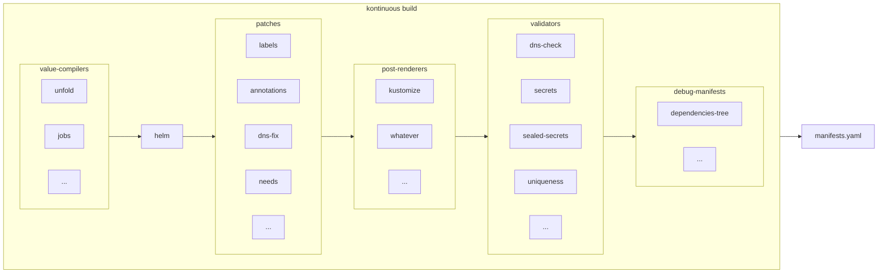

### 3. Build manifests



##### 3.1 Values

Defaults values are loaded from charts `values.yaml` files

Values are merged from project paths:

- `.kontinuous/values.yaml` (optional)
- `.kontinuous/${env}/values.yaml` (optional)
- `.kontinuous/values.js` (optional)

Then `values-compilers`, and optionaly `values.final.js`, will modify the values. See also [official plugins](#_47-official-plugins).

Some values can contain templating and use others values variables, but only if `tpl` Helm function is used to load value in Helm templates.

**dot notation values (shortcut syntax)**

by prefixing a value with dot character `.`, you can use dot notation to set values, like

```yaml
.a.nested.value: foobar
```

will be resolved to

```yaml
a:
  nested:
    value: foobar
```

###### meta-values

A meta-value is a value that will not be consumed by the chart directly, but extends the capacity of the chart to be modified at patching time according to values parameters provided by final dev user.

Meta-values are handled by the plugin contrib/patches/valuesPatches.

**meta-values plugin**

the prefix `~` will patch all manifests generated by the chart with kontinuous plugin annotation, so you'll can treat them with patches, example, "~needs: [test]"

```yaml
metadata:
  annotations:
    kontinuous/plugin.needs: [test]
```

meta-value `~chart` used to create an instance of a specific chart

```yaml
arbitrary-chart-instance-name:
  ~chart: app
```

example with fully qualified target

```yaml
arbitrary-chart-instance-name:
  ~chart: project.fabrique.contrib.app
```

`project` is a always the root chart name, matching repository level, `fabrique` is a kontinuous umbrella plugin that you can import, and `contrib` is a plugin that is imported by `fabrique`, `app` is the chart name.

**meta-values set**

```
chartName:
  ~.metadata.annotation.foo: bar
```

the prefix `~.` will patch all manifests generated by the chart with the dot notation syntax

##### 3.4 Templates

Every yaml file in `.kontinuous/templates` and `.kontinuous/${env}/templates` will be merged with the helm Chart `templates` folder before the build.

All theses files can use the Helm templating syntax (or not if you don't need it, helm template is a superset of yaml).

Both extensions yaml and yml are accepted.

Usually, that's where you put your CronJob, ConfigMap and SealedSecret ressources.

##### 3.5 A note on YAML

Kontinuous support retro-compatibility YAML syntax version 1.1, some chart, including the keycloak one need this. In old YAML syntax (1.1), octal can be converted to integer, for example octal `0555` is equal to integer `365`, in new YAML syntax (1.2) octal are considered as padded number, and it's not that do we want, because in this case octal `0555` is converted to integer `555` which is wrong. I don't know exact implementation of YAML in Helm, but current version of Helm v3 treat octal correctly, according to YAML 1.1 spec, and so, we can found charts that is compatible with Helm, but not compatible with new YAML syntax spec 1.2. In Kontinuous we need to parse `values.yaml` file including defaults one of charts that we merge in one global, so we need to support YAML 1.1 to be fully compliant with state of art.
