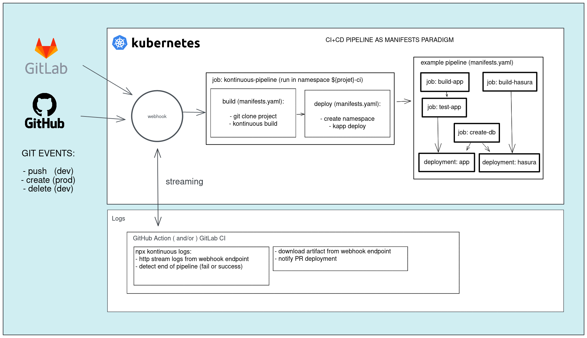

## Deploy

#### 6.1. CLI

Run `npx kontinuous deploy` from your project repository. Depending of your infra, you will need to pass options as `--ci-namespace <ns>` (needed at **_La Fabrique_** for example).

for help call:
`npx kontinuous deploy --help`

You can also generate the manifests and then deploy it using [carvel/kapp](https://carvel.dev/kapp/)

```sh
npx kontinuous build -o > /tmp/manifests.yaml

kapp deploy /tmp/manifests.yaml
  --app label:kontinuous/kapp=name-of-my-app \
  --logs-all \
  --dangerous-override-ownership-of-existing-resources \
  -f /tmp/manifests.yaml
```

#### 6.2. Github Actions

- Option 1: **webhook + github logs** (the recommended one)

  CI/CD pipeline are triggered using the [webhook service](#_63-using-webhook-service) and the github CI is only responsible of deployment logging and manifests artifact retrieving and publishing. Retrying an action is trigerring a new pipeline using the webhook endpoint 😉. <br>
  To do this way you have to configure the [webhook service](#_63-using-webhook-service) first, then, if you want to use github (no obligation), you can implement it as [reusable workflow](.github/workflows/workflow-logs.yaml) or [composite action](logs/action.yaml):

  reusable workflow (the recommended one):

  ```yaml
  jobs:
    follow-deployment:
      uses: socialgouv/kontinuous/.github/workflows/workflow-webhook.yaml@v1
      secrets: inherit
  ```

  It require to configure the webhook on `push`+`create` and `delete` events at repository level on the git platform. On rerun, the action will trigger the webhook itself.

  reusable workflow without using webhook feature of git platform:

  ```yaml
  jobs:
    follow-deployment:
      uses: socialgouv/kontinuous/.github/workflows/workflow-webhook.yaml@v1
      secrets: inherit
      triggerWebhook: true
  ```

  With the option `triggerWebhook`, the action will trigger webhook pipeline on first run, if not provided, it will expect that webhook feature has allready triggered webhook pipeline and try to catch it on the fly.

  composite action:

  ```yaml
  jobs:
    logs:
      name: logs
      runs-on: ubuntu-latest
      steps:
      - name: kontinuous pipeline
          uses: socialgouv/kontinuous/webhook@v1
          with:
            token: ${{ secrets.GITHUB_TOKEN }}
            webhookToken: ${{ secrets.KUBEWEBHOOK_TOKEN }}
            webhookUri: https://webhook-${{ secrets.RANCHER_PROJECT_NAME }}.fabrique.social.gouv.fr
            # triggerWebhook: true # uncomment this line to use trigger only by action, without using webhook trigger feature on git platform at repository config level
  ```

- Option 2: **rely on Github CI**:

  You can deploy using github actions, running kontinuous deploy in the github CI

  ```yaml
  jobs:
    deploy:
      name: deploy
      runs-on: ubuntu-latest
      steps:
      - name: kontinuous pipeline
          uses: socialgouv/kontinuous/gh-actions/deploy-via-github@v1
          with:
            token: ${{ secrets.GITHUB_TOKEN }}
            kubeconfig: ${{ secrets.KUBECONFIG }}
            rancherProjectId: ${{ secrets.RANCHER_PROJECT_ID }}
            rancherProjectName: ${{ secrets.RANCHER_PROJECT_NAME }}
  ```

- Option 3: **manual workflow action deployed via webhook**:

  If you want to deploy custom action manifests via webhook you can use flag `--on-webhook`/`-w` like

  ```sh
  npx kontinuous deploy --chart my-custom-action --on-webhook
  ```

  values.yaml

  ```yaml
  my-custom-action:
    enabled: false # so it will not be enabled by default on classical deployment task, but only on demand in a trigger workflow using `--chart my-custom-action`
  ```

  And naturally, you can put helm templates here: `.kontinuous/my-custom-action/template`

#### 6.3. using webhook service

Using the webhook service you can be totally independent and self-hosted for running you CI/CD workflow.
The service can be deployed using an [official Helm chart](https://github.com/socialgouv/kontinuous/blob/master/packages/webhook/Chart.yaml).

[](https://excalidraw.com/#json=OoAm9RLHobXlWw9DmzC6x,R0CXD2-2gYj8D-9OvJS3GA)

##### 6.3.1. deploy webhook

###### 6.3.1.1. using Helm

It require you have predefined these secrets (in the namespace `myproject-ci` in example): <br>

- kubeconfig-dev
- kubeconfig-prod
- kubewebhook

_You can replace secrets names using values key `secretRefNames`._

Secrets should contains following environment variables:

- `KUBEWEBHOOK_TOKEN`
- `KUBECONFIG` and/or `KUBECONFIG_DEV`+`KUBECONFIG_PROD`,

To see all avaiables values and defaults see [packages/webhook/values.yaml](https://github.com/socialgouv/kontinuous/blob/master/packages/webhook/values.yaml).

```sh
npx -y tiged socialgouv/kontinuous/packages/webhook@master kontinuous-webhook

cd ./kontinuous-webhook

helm template .  \
    --set ciNamespace=myproject-ci \
    --set host=webhook-myproject.fabrique.social.gouv.fr \
    > manifests.yaml

kubectl --namespace myproject-ci apply manifests.yaml
```

###### 6.3.1.2. using ArgoCD

Here is a sample of an [ArgoCD ApplicationSet](https://argo-cd.readthedocs.io/en/stable/roadmap/#applicationset): [plugins/fabrique/samples/argocd/kontinuous-webhooks.yaml](https://github.com/socialgouv/kontinuous/blob/master/plugins/fabrique/samples/argocd/kontinuous-webhooks.yaml)

##### 6.3.2. configure webhook on repository

You should configure webhook event on push event on repository (from github, gitlab (should be tested), gitea (should be dev))

###### 6.3.2.1. Github

In the github repository, go to **settings** -> **Webhooks** -> **Add webhook**

in _Payload URL_ field put the endpoint: https://webhook-myproject.fabrique.social.gouv.fr/api/v1/oas/hooks/github?event=pushed

In _Which events would you like to trigger this webhook?_
select "Just the push event".

Check the _Active_ checkbox.

Then click to _Add webhook_ and you're good for **dev** env.

For **prod**, do the same but replace endpoint by: https://webhook-myproject.fabrique.social.gouv.fr/api/v1/oas/hooks/github?event=created <br>
and after selecting _Let me select individual events_, ensure you have all unchecked (uncheck _push_ event that is generally checked by default) and check _Branch or tag creation_

If you have to configure for many repo and you want to make it automatically and _infra as code_, here is a terraform snippet sample: [plugins/fabrique/samples/terraform/rancher-config-setup/github.tf](https://github.com/socialgouv/kontinuous/blob/master/plugins/fabrique/samples/terraform/rancher-config-setup/github.tf)
