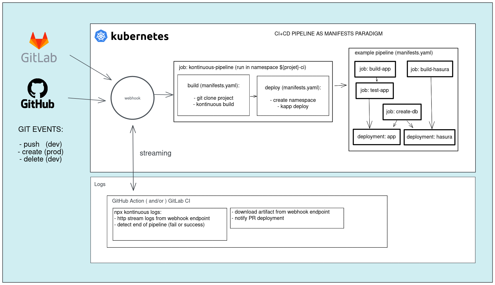

# Kontinuous - CI+CD on Kubernetes 🚀

Hey, you work at the marvelous Fabrique Numérique des Ministères Sociaux ?
[Go here for quickstart](#111-fabrique-quickstart)

## Why ?

Was needing a flexible, scalable and independent CI+CD system running on Kubernetes with fine grained control over pipelines.

## The approach

**K8S Manifest as pipeline**

All CI+CD pipeline is reproductible running kapp cli deploy command on the built yaml manifest.

**Philosophy**

Keep as close as possible of battle tested and confident tech paradigms as native kubernetes, helm and kapp, so we can use all theirs powers and abilities.


**Tech: (Helm ⛵ + Kapp 🌞) x NodeJS for the customization Kung-Fu 🥷**

- [helm](https://helm.sh/): build manifests from helm templates, so kontinuous is interoperable with the ecosystem of the most popular package manager for kubernetes, and use the only one templating language in go (also used in kubernetes cli)
- [carvel/kapp](https://carvel.dev/kapp/): to deploy ordered pipelines with advanced dependencies declarative system and following deployment state and reconciliation
- the kung-fu: to expose adapted and simplified logic to final dev users, with ready to use values system corresponding to infra, flexible patching system, easy to use plugin charts system etc...

## Documentation

### Summary

1. [Configuration](#1-configuration)
    1. [Boilerplate](#11-boilerplate)
        1. [Fabrique quickstart](#111-fabrique-quickstart)
    2. [Repository config](#12-repository-config)
    3. [Global config](#13-global-config)
    4. [CLI config](#14-cli-config)
    5. [Variables](#15-variables)

2. [Build manifests](#2-build-manifests)
    1. [CLI](#21-cli)
    2. [Environment](#22-environment)
    3. [Values](#23-values)
    4. [Templates](#24-templates)
    
  
3. [Plugins](#3-plugins)
    1. [types](#31-types)
    2. [repository](#32-repository)
    3. [charts](#33-charts)
    4. [values compilers](#34-values-compilers)
        - 4-bis [values.js](#34-bis-valuesjs)
    5. [patches](#35-patches)
        - 5-bis [post-renderer](#35-bis-post-renderer)
    6. [validators](#36-validators)
    7. [Offical plugins](#37-official-plugins)

4. [Samples](#4-samples)

5. [Deploy](#5-deploy)
    1. [CLI](#51-cli)
    2. [Github Actions](#52-github-actions)
    3. [using webhook service](#53-using-webhook-service)
        1. [deploy service](#531-deploy-service)
            1. [using helm](#5311-using-helm)
            2. [using argocd](#5312-using-argocd)
        2. [configure webhook on repository](#532-configure-webhook-on-repository)
            1. [Github](#5321-github)

6. [Development](#6-development)

7. [Links](#7-links)


# 1. Configuration

## 1.1 Boilerplate

Here is a sample of a boilerplate made for ***La Fabrique*** and that you can merge with files of your project.

### 1.1.1 Fabrique quickstart

Run this command in your project to retrieve boilerplate config for kontinuous and corresponding github workflows, then adjust the config in `.kontinuous` folder.

⚠️ Pay attention, this command will overwrite files if sames names are used, you should commit your work before running it.
```sh
npx -y tiged SocialGouv/kontinuous/plugins/fabrique/boilerplate --force
```

### 1.2 Repository config

The repository config file path is  `.kontinuous/config.yaml` and this file shoud be commited on the repo. No sensitive data should be included here.

sample for `.kontinuous/config.yaml` :
```yaml
projectName: my-project # default to repository name extracted from git url
dependencies:
  fabrique:
    import: SocialGouv/kontinuous/plugins/fabrique
```

### 1.3 Global config

The global config file path is  `~/.kontinuous/config.yaml` where `~` is your `$HOME` path. You can configure specific environment for your workstation. This file can contain sensitive data as webhook token for projects.

The global config is merged as default config to your project config when running kontinuous.

All keys are same except `projects` and `organizations`:
- Subkeys of `projects` will be merged only when the key match with `projectName`.
- Subkeys of `organizations` will be merged only when the key match with `organization`, than can be defined at project config level or in `projects` of global config, like in the example.


sample for `~/.kontinuous/config.yaml` :
```yaml
links:
  SocialGouv/kontinuous: /lab/fabrique/sre/kontinuous

organizations:
  fabrique:
    webhooks:
        baseDomain: fabrique.social.gouv.fr
        uriPattern: https://webhook-${repositoryName}.${baseDomain}

projects:
  my-project:
    organization: fabrique
    webhook:
      token: "********************************"
```

### 1.4 CLI config

CLI is fully documented, you can consult help using `npx kontinuous --help` to kown all available commands.
Consult help and avaiables options using `--help` on each command, for example to display help from build command run `npx kontinuous build --help`.

### 1.5 Variables

Most of the configuration can be defined in 3 ways:
- config files (global, then by project)
- environment variables (override config file)
- command line options (override environment variables)

For exhaustive description of behavior you can [check the source code](packages/kontinuous/src/cli/load-config.js). <br>
Here are the main (titles are config keys):

- **links** <br>
    Allow you to replace degit path on the fly when using kontinuous plugin system, copying from local folder instead of remote repository.
    sample for `~/.kontinuous/config.yaml` :
    ```yaml
    links:
        SocialGouv/kontinuous: /lab/fabrique/sre/kontinuous
    ```

    In this case, all plugins call starting with `SocialGouv/kontinuous` will be loaded from local `/lab/fabrique/sre/kontinuous`. Usefull for development.

- **workspacePath** <br>
    env: `KS_WORKSPACE_PATH` <br>
    option: `--cwd` <br>
    commands: `build`,`deploy`,`env`,`logs` <br>
    default: current working directory

- **workspaceSubPath** <br>
    env: `KS_WORKSPACE_SUBPATH` <br>
    commands: `build`,`deploy`,`logs` <br>
    default: ".kontinuous"

- **gitRepositoryUrl** <br>
    env: `KS_GIT_REPOSITORY_URL` <br>
    commands: `build`,`deploy` <br>
    default: retrieved from workspace .git

- **gitBranch** <br>
    env: `KS_GIT_BRANCH`,`KS_GIT_REF` <br>
    option: `--branch` <br>
    commands: `build`,`deploy`,`env`,`logs` <br>
    default: retrieved from workspace .git

- **gitSha** <br>
    env: `KS_GIT_SHA` <br>
    option: `--commit` <br>
    commands: `build`,`deploy`,`env`,`logs` <br>
    default: retrieved from workspace .git

- **kontinuousPath** <br>
    env: `KS_KONTINUOUS_PATH` <br>
    commands: `build`,`deploy` <br>
    default: kontinuous package directory

- **chart** <br>
    env: `KS_CHART` <br>
    option: `--chart` <br>
    commands: `build`,`deploy` <br>
    Allow you to disable all charts, except the specified ones. Can be provided as a JSON array or comma separated list.

- **helmArgs** <br>
    env: `KS_HELM_ARGS` <br>
    option: `--helm-args` <br>
    commands: `build`,`deploy` <br>
    Extra args for `helm template` command.

- **inlineValues** <br>
    env: `KS_INLINE_VALUES` <br>
    option: `--inline-values` <br>
    commands: `build`,`deploy` <br>
    Deep override of user provided values (before values-compilers plugins processing).
    sample:
    ```yaml
    a:
      sub:
        key:
          override: newValue
    ```

- **set** <br>
    env: `KS_INLINE_SET` <br>
    option: `--set` <br>
    commands: `build`,`deploy` <br>
    Override values using dot key notation (see [lodash.set method](https://lodash.com/docs/4.17.15#set)). Can be provided as flat yaml/json object from envrionment variable or multiple call to `--set` option (eg: `--set foo=bar --set bar=jo`)
    sample:
    ```yaml
    a.sub.key.override: newValue
    ```

- **buildPath** <br>
    env: `KS_BUILD_PATH` <br>
    commands: `build`,`deploy` <br>
    default: unique temporary directory is created for each command run

- **uploadUrl** <br>
    env: `KS_BUILD_UPLOAD_URL` <br>
    option: `--upload` <br>
    commands: `build`,`deploy` <br>
    Used to upload generated manifests as artifact on the webhook service.

- **statusUrl** <br>
    env: `KS_DEPLOY_STATUS_URL` <br>
    option: `--status-url` <br>
    commands: `build`,`deploy` <br>
    Used to save the status of a pipeline on the webhook service.

- **environment** <br>
    env: `KS_ENVIRONMENT` <br>
    option: `--env, -e` <br>
    commands: `build`,`deploy`,`env`,`logs` <br>
    default: from `gitBranch`: `prod` when on tag matching `v*`, preprod when `master`/`main` branch, `dev` otherwise

- **webhookBaseDomain** <br>
    env: `KS_WEBHOOK_BASE_DOMAIN` <br>
    option: `--webhook-base-domain` <br>
    commands: `deploy`,`logs` <br>
    Not used if `webhookUri` is defined.

- **webhookUriPattern** <br>
    env: `KS_WEBHOOK_URI_PATTERN` <br>
    option: `--webhook-uri-pattern` <br>
    commands: `deploy`,`logs` <br>
    Template for webhook uri. Replaced variables: `${repositoryName}` and `${baseDomain}` (replaced by `webhookBaseDomain`). Not used if `webhookUri` is defined.

- **webhookUri** <br>
    env: `KS_WEBHOOK_URI` <br>
    option: `--webhook-uri` <br>
    commands: `deploy`,`logs` <br>
    default: if `webhookUriPattern` is defined, will use it to generate it replacing `${repositoryName}` and `${baseDomain}` variables.
    The URI to communicate with kontinuous webhook deployed service (it's expected to be a [kontinuous webhook service](packages/webhook/)).

- **ciNamespace** <br>
    env: `KS_CI_NAMESPACE` <br>
    option: `--ci-namespace` <br>
    commands: `build`,`deploy` <br>
    default: `${config.repositoryName}-ci`
    Used to run main pipelines and ci jobs from [`recommended/charts/jobs`](plugins/recommended/charts/jobs/) plugin. Used to retrieve `rancherProjectId` from namespace when not provided when running `deploy` command.

- **rancherProjectId** <br>
    env: `RANCHER_PROJECT_ID` <br>
    option: `--rancher-project-id` <br>
    commands: `build`,`deploy`,`env`,`logs` <br>
    default: retrieved from `ciNamespace` when running `deploy` command.<br>
    Used to create namespace when running `deploy` command and provided as global chart value from plugin [`fabrique/values-compilers/global-defaults`](plugins/fabrique/values-compilers/global-defaults.js) on `build` command.


# 2. Build manifests

## 2.1 CLI

Go into to the repository directory containing `.kontinuous` dir, then run `npx kontinuous build -o`.
You will see the generated manifests.

pre-requisites:

- helm v3 [install guide](https://helm.sh/docs/intro/install/)
  ```sh
  curl https://raw.githubusercontent.com/helm/helm/main/scripts/get-helm-3 | bash
  ```
- node >= 14
- yarn


You can also redirect it to file like this:
```sh
npx kontinuous build -o > manifests.yaml
```

If you want syntaxic coloration in shell:
```sh
npx kontinuous build -so
```


You can debug like this:
```sh
npx kontinuous build -d
```

To see all available options:
```sh
npx kontinuous build --help
```

For development (require helm):
```sh
git clone https://github.com/SocialGouv/kontinuous.git ~/repos/kontinuous
cd ~/repos/kontinuous
yarn install

cd ~/repos/my-project
~/repos/kontinuous/kontinuous build
```

Obviously you can replace `~/repos/my-project` and `~/repos/kontinuous` by any directory path.

### 2.2 Environment

Environment can be provided using `KS_ENVIRONMENT` environment variable, `--env` option, or is autoselected from `.git`. It will be `prod` on tag ref matching with `v*`, will be `preprod` when branch name is `main` or `master`, otherwise it will be `dev`.

`values.yaml` files and `templates` directories will be merged from `.kontinuous/env/${env}`.

### 2.3 Values

Defaults values are loaded from charts `values.yaml` files

Values are merged from project paths:
- `.kontinuous/values.yaml` (optional)
- `.kontinuous/${env}/values.yaml` (optional)
- `.kontinuous/values.js`  (optional)

Then `values-compilers` will modify values. See also [official plugins](#37-official-plugins).

Some values can contain templating and use others values variables, but only if `tpl` Helm function is used to load value in Helm templates.

### 2.4 Templates

Every yaml file in `.kontinuous/templates` and `.kontinuous/${env}/templates` will be merged with the helm Chart `templates` folder before the build.

All theses files can use the Helm templating syntax (or not if you don't need it, helm template is a superset of yaml).

Both extensions yaml and yml are accepted.

Usually, that's where you put your CronJob, ConfigMap and SealedSecret ressources.


## 3 Plugins


**Core**

The core is responsible to merge config, values, templates and process plugins, most of the logic is delegated to plugins. The core is also responsible of tree directory structure creation in temporary folder, yarn install when needed, then helm template calling.

**Plugins**

All custom logic can be implemented in plugins. By creating plugins you can covers all uses cases. 

## 3.1 types

There are differents type of plugins:
- charts: it's basically all helm charts, you can import from helm repository or declare your own in git repository
- values-compilers: transform user defined values to be consummed by charts
- patches: patches applies to final generated kubernetes manifests
- validators: make custom conformity checks on final generated kubernetes manifests
- import: you can combine multiples plugins in one repository using import plugin
All plugins follow a recursive design pattern, imported `import` plugin can import another repo (example project import fabrique, fabrique import recommended etc...), all charts can have subcharts, that can have subchart etc..., it the same for values-compilers, patches, and validators.
When you import recursively there is an arborescence autobuild.

## 3.2 repository

A repository plugin is the container for all other plugins types. It's basically a git repository, or subdirectory of a git repository. It can be versioned as a git repo. <br>
A repository plugin can import other repository plugin, dependencies are recursives. <br>
You can import repository plugins from `.kontinuous/config.yaml` in your project and in `kontinous.yaml` in the plugin directory. <br>
You have to name the import from the plugin caller using key. This name will be used for subchart values autolinking. <br>

example:

`$PROJECT_WORKSPACE/.kontinuous/config.yaml`
```
dependencies:
  fabrique:
    import: SocialGouv/kontinuous/plugins/fabrique
```

`SocialGouv/plugins/fabrique/kontinuous.yaml`
```yaml
dependencies:
  recommended:
    import: SocialGouv/kontinuous/plugins/recommended
```

`$PROJECT_WORKSPACE/.kontinuous/values.yaml`
```
fabrique:
  recommended:
    some-chart:
      aValueToBeConsumedByAppSomeChartOfRecommendedPlugin: Hello World !
```


`charts`, `values-compilers`, `patches` and `validators` will be autolinked and implicitely applied recursively. You can control order, or optout by creating index.js in each `values-compilers`, `patches` or `validators` directories, then you can include from dependencies plugins yourself. <br>
See [plugins/fabrique/patches/index.js](plugins/fabrique/patches/index.js) for example.

You can create and use `charts`, `values-compilers`, `patches` and `validators` directories in `.kontinuous` at project level in your project path, or in plugin root path. Project level plugins can consume plugins in the same way the plugins can consume other plugins.

You can add a `package.json` and a `yarn.lock` file at root of your kontinuous plugin directory, kontinuous will install it using `yarn`, so you can use node dependencies in your `values-compilers`, `patches` and `validators`.

## 3.3 charts

Charts plugin are basically helm charts, that can be autolinked from the umbrella (name for the main chart in helm jargon). <br>
If you doesn't create a `Chart.yaml` in a chart repository, a default on will be created for you by kontinuous. <br>
A parent chart will be automatically created from project/plugin path, charts that are present in the `charts` directory will be automatically added to this chart as subcharts (`dependencies` key in `Chart.yaml`). <br>


## 3.4 values-compilers

As it's name suggest it, it's values compilers, that will transform values declared in `values.yaml` files in final values that will be consumed by `helm`. <br>
Most often values-compilers are here to make values leaner to declare for final dev user. <br>
Values compilers are pure nodeJS file that have to export commonJS function that will receive values object and has to return values object or undefined. Returned values object will be used if returned, else you can mutate values object directly. <br>
Here are the args that the function will receive: `module.exports = (values, options, { config, utils, ctx }) => values` <br>
- `values` is the values object
- `options` is the options that can be defined at plugin/project level, eg:
    `$PROJECT_WORKSPACE/.kontinuous/values.yaml`
    ```
    dependencies:
      fabrique:
        import: SocialGouv/kontinuous/plugins/fabrique
        values-compilers:
          global-defaults:
            options:
              foo: bar
    ```
- `config` is the current [kontinuous config](#15-variables)
- `utils` is a toolset of helpers function used in kontinuous itself and exposed, all are defined here: [packages/common/utils](packages/common/utils)
- `ctx` is the async context dependency injection container of kontinous, it can be used to retrieve config or logger, eg: `logger = ctx.get("logger")`

## 3.4-bis values.js

Instead or additionaly to using a `values.yaml`, you can use a project level only values compiler, that will be runned before all others (bu after retrieving and merging values from `values.yaml` files), creating a values.js file.


## 3.5 patches

Patches are pure nodeJS file used to modify final `manifests` after compiled by `helm template`. <br>
Same as `values-compilers` and `validators`, patches has to expose a function using commonJS. This function will receive the kubernetes manifests as an array of object that you can mutate directly or use to produce a new one that you will return. <br>
Here are the args that the function will receive: `module.exports = (values, options, { config, utils, ctx, logger, values }) => values` <br>
See [values-compilers doc for details on arguments](#34-values-compilers)


NodeJS patches are more flexible than `kustomize` patches that had be abandonned for following reasons:
- https://github.com/kubernetes-sigs/kustomize/issues/947
- https://github.com/kubernetes-sigs/kustomize/issues/1493

If you want to use `kustomize` anyway, the easiest way is to use [`post-renderer`](#35-bis-post-renderer)


## 3.5-bis post-renderer

Aka *Hack the manifests*

By creating an executable file called `post-renderer` in `.kontinuous` directory at project level, you can declare an helm post-renderer. So you can modify your manifest easily using [`jq`](https://stedolan.github.io/jq/) Eg:
```sh
#!/bin/sh

set -e

# load into variable from standard input
manifest=$(cat)<&0

# arbitrary modify some stuf
manifest=`echo "$manifest" | jq 'map(select(.kind == "Namespace").metadata.labels.foo = "bar")'`

# output
echo "$manifest"
```

Or if you want to use kustomize (not recommended for reasons explained in [patches documentation chapter](#35-patches))

```sh
#!/bin/sh
manifest=$(cat)<&0
echo "$manifest" > base.yaml
kustomize build .
```


## 3.6 validators
Validators are pure nodeJS file used to validate final `manifests` after compiled by `helm template`. <br>
Same as `values-compilers` and `patches`, validators has to expose a function using commonJS. This function will receive the kubernetes manifests as an array of object. <br>
When a manifest contain an invalid definition you have to throw an error this way `throw new Error("error message")`.

Here are the args that the function will receive: `module.exports = (manifests, values, options, { config, utils, ctx, logger }) => {}` <br>
See [values-compilers doc for details on arguments](#34-values-compilers)


## 3.7 official plugins

Official plugins are here [plugins/recommended/](plugins/recommended/). They could be put in another git repository, but was kept in main repository for testing purpose.

- **[recommended](plugins/recommended/)**
    - [charts/jobs](plugins/recommended/charts/jobs) <br>
        generic kubernetes jobs chart, used for easily declare CI pipelines from values <br>
        *it require [values-compilers/jobs](plugins/recommended/values-compilers/jobs.js)*

        example `.kontinuous/values.yaml`:
        ```yaml
        hasura:
          needs: [db]

        jobs:
          runs:
            db:
              # use: ./.kontinous/jobs/create-db # local job, defined in project repository
              # use: https://github.com/SocialGouv/kontinuous/plugins/fabrique/jobs/create-db # degit full url
              use: SocialGouv/kontinuous/plugins/fabrique/jobs/create-db # degit implicit github
              with:
                pgAdminSecretRefName: pg-scaleway
            seed:
              needs: [hasura]
              use: SocialGouv/kontinuous/plugins/fabrique/jobs/seed-db
              with:
                seedPath: path/in/repo.sql
        ```

        see [plugins/fabrique/jobs/create-db/use.yaml](plugins/fabrique/jobs/create-db/use.yaml) for full example.
        All vues from `runs` keys will be interpolated in the job, but you can also uses all parameters directly, except the `with` parameter that is reserved to be used with `use` and inject variable to the called job.

        All others components can declare dependencies on jobs using the `needs` key, and all jobs can declare depencencies on other jobs and other components too, using instances names.

        Mains jobs parameters are:

        - `use` and `with`: to include job definition from elsewhere, usage can be recursive (job can use job, that can use job etc...)
        - `image` the docker image file that will run the job (default is debian for now, in future this will be a generic image with almost all needed tooling)
        - `action` repository (or subfolder in a repository) that will be degitted in mountpoint `/action/` in the job execition
        - `run` a custom command that will override docker image default run, can be a full bash script or just a call to a command
        - `checkout` (default `true`), this enable the degit of the repository at current commit in mountpoint `/workspace/` in the job
        - `if` condition to include the job, can contain variables from values

    - [charts/kontinuous-helpers](plugins/recommended/charts/kontinuous-helpers) <br>
        common helm [library chart](https://helm.sh/docs/topics/library_charts/), contains helpers helm templating snippets that can be reused in any subchart, helping you to keep your charts DRY

    - [patches/namespace](plugins/recommended/patches/namespace.js) <br>
        Add the current kubernetes namespace from [kontinuous config](#15-variables) to all manifests that doesn't declare explicitly a namespace

    - [patches/dns-truncate](plugins/recommended/patches/dns-truncate.js) <br>
        Truncate and hash all manifests name and ingress domains that is over the max allowed 63 characters.

    - [patches/kapp](plugins/recommended/patches/kapp.js) <br>
        Add `fallback-on-update` and `fallback-on-replace` update and create strategies, and `disable-original` to fix kapp issue [#472](https://github.com/vmware-tanzu/carvel-kapp/issues/472)

    - [validators/dns-limit](plugins/recommended/validators/dns-limit.js) <br>
        Check that all manifests name and ingress domains is not over the max allowed 63 characters. This should never fail if you use [patches/dns-truncate](plugins/recommended/patches/dns-truncate.js).

    - [validators/needs](plugins/recommended/validators/needs.js) <br>
        Check that there is no delcared as required resource that doesn't exists in the manifests.

    - [validators/resources-uniqness](plugins/recommended/validators/resources-uniqness.js) <br>
        Check that there is no duplicate resource name for the same kind.

    - [values-compilers/dash-instances](plugins/recommended/values-compilers/dash-instances.js) <br>
        Compile values key at root level that start with existing chart name, including dependencies chart name, as `${chartName}-arbitrary-instance-name`, to make a chart alias and implement an instance the chart.

        You can declare as many instances as you want of a chart, the name must start with the chart's name suffixed by `-`, eg:

        ```yaml
        app:
          host: ozensemble.fr
          redirectFrom:
            - "{{ .Values.global.host }}"
            - www.ozensemble.fr

        app-2nd-instance:
          probesPath: /healthz
          envFrom:
            - secretRef:
                name: "{{ .Values.global.pgSecretName }}"
            - secretRef:
                name: app-sealed-secret
            - configMapRef:
                name: app-configmap
        ```

    - [values-compilers/unfold-charts](plugins/recommended/values-compilers/unfold-charts.js) <br>
        Refacto the value tree on the fly matching the root level key name with dependencies subcharts names. Example, if you import `fabrique` kontinous plugin in your project: <br>
        `.kontinous/values.yaml`
        ```yaml
        app: {}
        ```
        will be compiled into: <br>
        ```yaml
        fabrique:
          app: {}
        ```
        And if you use `jobs` chart values key of `recommended` plugin that is imported by `fabrique` plugin: <br>
        `.kontinous/values.yaml`
        ```yaml
        jobs: {}
        ```
        will be compiled in: <br>
        ```yaml
        fabrique:
          recommended:
            jobs: {}
        ```
        And so, on helm template compilation run, the values of jobs can be consumed by `jobs` chart, that is a subchart of `recommended`, that is itself a subchart of `fabrique`. FYI helm subcharts are natively recursive.

    - [values-compilers/implicit-enabled](plugins/recommended/values-compilers/implicit-enabled.js) <br>
        Compile declared charts's values to implicit set `enabled` to `true`.

    - [values-compilers/jobs](plugins/recommended/values-compilers/jobs.js) <br>
        Compile jobs simple values to be used by final chart, it includes the downloading of reusable `jobs` (using the `use` keyword) and merging of values from the imported job.
        
- **[fabrique](plugins/fabrique/)**
    - [charts/rancher-namespace](plugins/fabrique/charts/rancher-namespace) <br>
        add a namespace configured with provided with rancherProjectId for [rancher](https://rancher.com/) right management. Enabled by default when `chart` kontinuous config is not provided.

    - [charts/security-policies](plugins/fabrique/charts/security-policies) <br>
        add some default kube security policies. Enabled by default when `chart` kontinuous config is not provided.

    - [charts/app](plugins/fabrique/charts/app) <br>
        Generic chart that can be used to deploy differents apps targeting a docker image, as frontend, backend etc...
        
    - [charts/hasura](plugins/fabrique/charts/hasura) <br>
        deploy an instance of [hasura](https://hasura.io/)
    
    - [charts/pgweb](plugins/fabrique/charts/pgweb) <br>
        deploy an instance of [pgweb](https://github.com/sosedoff/pgweb)
    
    - [charts/maildev](plugins/fabrique/charts/maildev) <br>
        deploy an instance of [maildev](https://github.com/maildev/maildev)
    
    - [charts/metabase](plugins/fabrique/charts/metabase) <br>
        deploy an instance of [metabase](https://www.metabase.com/)

    - [charts/oauth2-proxy](plugins/fabrique/charts/oauth2-proxy) <br>
        deploy an instance of [oauth2-proxy](https://github.com/oauth2-proxy/oauth2-proxy)

    - [charts/redis](plugins/fabrique/charts/redis) <br>
        deploy an instance of [redis](https://redis.io/)
        
    - [patches/cert-letsencrypt-issuer](plugins/fabrique/patches/cert-letsencrypt-issuer.js) <br>
        add annotation to use `letsencrypt-prod` cluster-issuer using `cert-manager` on `ingress` to prod manifests.
    
    - [patches/cert-wildcard](plugins/fabrique/patches/cert-wildcard.js) <br>
        add label `cert: "wildcard"` on main namespace so `kubed` will copy wildcard cert on dev environment namespaces.
    
    - [patches/rancher-project-id](plugins/fabrique/patches/rancher-project-id.js) <br>
        if namespace containing an empty `field.cattle.io/projectId` annotation, and `ciNamespace` config is defined (usually when `deploy` command is used), it will try to retrieve rancher project id from the `ciNamespace` to fill it.
        
    - [values-compilers/global-defaults](plugins/fabrique/values-compilers/global-defaults.js) <br>
        All defaults values for ***La Fabrique*** are defined here.
        Here is available global values that you can consume in every charts's templates:
        - certSecretName
        - repository
        - repositoryName
        - isDev
        - isProd
        - isPreProd
        - ttl
        - namespace
        - rancherProjectId
        - pgSecretName
        - pgDatabase
        - pgUser
        - host
        - domain
        - registry
        - imageProject
        - imageRepository
        - imageTag
        - branchSlug
        - branchSlug32
        - gitBranch
        - ciNamespace
        - sha
        - shortSha
        - env
    
    - [jobs/build](plugins/fabrique/jobs/build) <br>
        Build `docker` image from project Dockerfile and directory using `kaniko`.
    
    - [jobs/create-db](plugins/fabrique/jobs/create-db) <br>
        Create DB and associated new user for review branches using pg admin user.
    
    - [jobs/drop-db](plugins/fabrique/jobs/drop-db) <br>
        Drop a DB using pg admin user. Can be used before create-db to keep a pristine db on review branch.

    - [jobs/pg-restore](plugins/fabrique/jobs/pg-restore) <br>
        Restore a DB from backup using pg_restore.
    
    - [jobs/psql](plugins/fabrique/jobs/psql) <br>
        Run a sql file on DB from project repository.

    - [jobs/seed-db](plugins/fabrique/jobs/seed-db) <br>
        Run a sql file on DB from project repository using pg secret from target namespace.

# 4. Samples

There are many sample here [packages/kontinuous/tests/samples](packages/kontinuous/tests/samples). <br>
Except in case there is a `.kontinuous` file here, the directories are assumed to be the `.kontinuous` dir of projects. The `.env` files are only consumed in tests and will be ignored by kontinuous in real build and deployments.

More samples will be added on demand when feedback for this current documentation will reveal that it's not easy to find and understand how to do a thing. Don't hesitate to ask for enrichment of this section 😉.

# 5. Deploy

## 5.1. CLI

Run `npx kontinuous deploy` from your project repository. Depending of your infra, you will need to pass options as `--ci-namespace <ns>` (needed at ***La Fabrique*** for example).

for help call:
`npx kontinuous deploy --help`

You can also generate the manifests and then deploy it using [carvel/kapp](https://carvel.dev/kapp/)
```sh
npx kontinuous build -o > /tmp/manifests.yaml

kapp deploy /tmp/manifests.yaml
  --app label:kontinuous/kapp=name-of-my-app \
  --logs-all \
  --dangerous-override-ownership-of-existing-resources \
  -f /tmp/manifests.yaml
```


## 5.2. Github Actions

- Option 1: **webhook + github logs**  (the recommended one)

    CI/CD pipeline are triggered using the [webhook service](#53-using-webhook-service) and the github CI is only responsible of deployment logging and manifests artifact retrieving and publishing. Retrying an action is trigerring a new pipeline using the webhook endpoint 😉. <br>
    To do this way you have to configure the [webhook service](#53-using-webhook-service) first, then, if you want to use github (no obligation), you can implement it as [reusable workflow](.github/workflows/workflow-logs.yaml) or [composite action](logs/action.yml):

    reusable workflow (the recommended one):
    ```yaml
    jobs:
      follow-deployment:
        uses: SocialGouv/kontinuous/.github/workflows/workflow-logs.yaml@master
        secrets: inherit
    ```

    see also [plugins/fabrique/boilerplate/.github/workflows](plugins/fabrique/boilerplate/.github/workflows) for [generic setup of ***La Fabrique***](#111-fabrique-quickstart).


    composite action:
    ```yaml
    jobs:
      logs:
        name: logs
        runs-on: ubuntu-latest
        steps:
        - name: kontinuous pipeline
            uses: SocialGouv/kontinuous/logs@master
            with:
              token: ${{ secrets.GITHUB_TOKEN }}
              webhookToken: ${{ secrets.KUBEWEBHOOK_TOKEN }}
              webhookUri: https://webhook-${{ secrets.RANCHER_PROJECT_NAME }}.fabrique.social.gouv.fr
    ```

- Option 2: **rely on Github CI**:

    You can deploy using github actions, running kontinuous deploy in the github CI
    ```yaml
    jobs:
      deploy:
        name: deploy
        runs-on: ubuntu-latest
        steps:
        - name: kontinuous pipeline
            uses: SocialGouv/kontinuous@master
            with:
              token: ${{ secrets.GITHUB_TOKEN }}
              kubeconfig: ${{ secrets.KUBECONFIG }}
              rancherProjectId: ${{ secrets.RANCHER_PROJECT_ID }}
              rancherProjectName: ${{ secrets.RANCHER_PROJECT_NAME }}
    ```

## 5.3. using webhook service

Using the webhook service you can be totally independent and self-hosted for running you CI/CD workflow.
The service can be deployed using an [official Helm chart](packages/webhook/Chart.yaml).

[](https://excalidraw.com/#json=gKk7kOn6a9tbmkRZlPige,IQnqqMuiEPgmWbd39GlUYg)

### 5.3.1. deploy service

#### 5.3.1.1. using [Helm](https://helm.sh/)

It require you have predefined these secrets (in the namespace `myproject-ci` in example): <br>
- kubeconfig-dev
- kubeconfig-prod
- kubewebhook

*You can replace secrets names using values key `secretRefNames`.*

Secrets should contains following environment variables:
- `KUBEWEBHOOK_TOKEN`
- `KUBECONFIG` and/or `KUBECONFIG_DEV`+`KUBECONFIG_PROD`,


To see all avaiables values and defaults see [packages/webhook/values.yaml](packages/webhook/values.yaml).


```sh
npx -y tiged SocialGouv/kontinuous/packages/webhook@master kontinuous-webhook

cd ./kontinuous-webhook

helm template .  \
    --set ciNamespace=myproject-ci \
    --set host=webhook-myproject.fabrique.social.gouv.fr \
    > manifests.yaml

kubectl --namespace myproject-ci apply manifests.yaml
```

#### 5.3.1.2. using [ArgoCD](https://github.com/argoproj/argo-cd/)

Here is a sample of an [ArgoCD ApplicationSet](https://argo-cd.readthedocs.io/en/stable/roadmap/#applicationset): [plugins/fabrique/samples/argocd/kontinuous-webhooks.yaml](plugins/fabrique/samples/argocd/kontinuous-webhooks.yaml)

### 5.3.2. configure webhook on repository

You should configure webhook event on push event on repository (from github, gitlab (should be tested), gitea (should be dev))

#### 5.3.2.1. Github

In the github repository, go to **settings** -> **Webhooks** -> **Add webhook**

in *Payload URL* field put the endpoint: https://webhook-myproject.fabrique.social.gouv.fr/api/v1/oas/hooks/github?event=pushed

In *Which events would you like to trigger this webhook?*
select "Just the push event".

Check the *Active* checkbox.

Then click to *Add webhook* and you're good for **dev** env.

For **prod**, do the same but replace endpoint by: https://webhook-myproject.fabrique.social.gouv.fr/api/v1/oas/hooks/github?event=created <br>
and after selecting *Let me select individual events*, ensure you have all unchecked (uncheck *push* event that is generally checked by default) and check *Branch or tag creation*

If you have to configure for many repo and you want to make it automatically and *infra as code*, here is a terraform snippet sample: [plugins/fabrique/samples/terraform/rancher-config-setup/github.tf](plugins/fabrique/samples/terraform/rancher-config-setup/github.tf)

# 6. Development

```sh
git clone git@github.com:SocialGouv/kontinuous.git
cd kontinuous
yarn
```

Setup [global config as in doc example](#13-global-config); I attire your attention on the fact that you can override remote repo to local directory using `links` key.

to run tests:

```sh
# to run all tests
yarn test

# to run kontinuous cli tests
yarn test:kontinuous

# to run webhook tests
yarn test:webhook
```

To run manifests build command in repo:

```sh
cd /lab/fabrique/sre/template
/lab/fabrique/sre/kontinuous/packages/kontinuous/bin/kontinuous build -so -d
```

You can start to create new plugins or modify kontinous core (no, seriously, don't do that if you don't know what you're doing and you havent really try to find a way to accomplish your goal using plugin, theorically you'll can accomplish almost everything with plugins system).

## Releasing

### Automatic

Execute the [Trigger Release](https://github.com/SocialGouv/kontinuous/actions/workflows/trigger-release.yml) workflow to trigger a new release of actions and helm charts.

### Manual

Releasing follow semantic versioning using [standard-version tool](https://github.com/conventional-changelog/standard-version). Versioning can be trigerred manually on dev machine to not block rapid iteration of master branch code : just run `yarn release` on master branch and CHANGELOG will be feeded with informations from commits using the conventionnal commit standard, then package will be bumped, as the charts versions and commited, then tagged. Then just follow cli instruction that say: `git push --follow-tags`. Then the action will publish automatically new version of npm cli, and charts index.

## Contributing (developments on kontinuous)

### Run locally

#### prepare kontinuous

```sh
git clone https://github.com/SocialGouv/kontinuous.git
cd kontinuous
yarn install
```

#### kontinuous cli

```sh
cd ~/repos/my-project
~/repos/kontinuous/kontinuous --help
```

##### kontinuous webhook service

```sh
yarn dev:webhook
```

open your navigator on [http://localhost:7530/api/v1/swagger/](http://localhost:7530/api/v1/swagger/) to test the OpenAPI using the provided and awesome Swagger.


### Test

all directories added to [packages/kontinuous/tests/samples](packages/kontinuous/tests/samples) are like a `.kontinuous` directory in a project, it will be automatically tested when you will run `yarn test:kontinuous`. <br>
To run only one test at once you can run `yarn test:kontinuous -t name-of-my-test`. <br>
To upgrade snapshots run `yarn test:kontinuous -u`. <br>

### Contribute adding more Helm charts

New charts are welcome in folders [plugins/recommended/charts/](plugins/recommended/charts/) (when universal) and [plugins/fabrique/charts/](plugins/fabrique/charts/) (when more *La Fabrique* opinionated, in doubt, purpose it here).
More options on existing charts will be carefully design, in case of doubt, or if you don't want to wait, you can hack everything using [post-renderer](#35-bis-post-renderer) or [patches](#35-patches) from your repository. Feel free, then give us feedback to ensure we follow best practices and are preserving project maintainability.

### Contribute adding more plugins

New patches are welcome in folder [plugins/fabrique/patches/](plugins/fabrique/patches/). <br>
New validators are welcome in folder [plugins/fabrique/validators/](plugins/fabrique/validators/). <br>
New jobs are welcome in folder [plugins/fabrique/jobs/](plugins/fabrique/jobs/). <br>
New values-compilers are welcome in folder [plugins/fabrique/values-compilers/](plugins/fabrique/values-compilers/). <br>

### *La Fabrique* images CI build

To be independent from github, the images used by default by the webhook Chart is retrieved from our GitLab instance at https://gitlab.fabrique.social.gouv.fr

To push on GitLab and be able to deploy new version of webhook you have to add GitLab remote to your local git. <br>
You can do it running this command:

```sh
git remote add gitlab git@gitlab.fabrique.social.gouv.fr:sre/kontinuous.git
```

then to push

```sh
yarn push:gitlab
```

### Docker image kontinuous cli

**to use official docker image**
```sh
docker run 
  -t \
  -u $UID \
  -v $PWD:/workspace \
  -v $HOME/.kube:/home/ubuntu/.kube \
  harbor.fabrique.social.gouv.fr/sre/kontinuous \
  --help
```


**to build local docker image**
```sh
cd ~/repos/kontinuous

docker build -f packages/kontinuous/Dockerfile . -t kontinuous
```

**to run local docker image**
```sh
cd ~/repos/my-project

docker run \
  -t \
  -u $UID \
  -v $PWD:/workspace \
  -v $HOME/.kube:/home/ubuntu/.kube \
  kontinuous \
  --help
```

### Going further (R&D investigations)

#### Running the full CI Locally

Here is the gap between our infra, at ***La Fabrique***, and a fresh minikube install on a developer's personal laptop:

- operators (kubernetes)
    - [kubeseal](https://github.com/bitnami-labs/sealed-secrets)
    - [kubed](https://appscode.com/products/kubed/v0.12.0/setup/)
    - [cert-manager](https://cert-manager.io/docs/)
- services
    - registry (docker)
    - postgres
- manifests
    - namespace-ci with secret kubeconfig + custom db_secret
- helm values
    - storageClassName (azurefile -> ???)
    - registry (harbor -> ???)
    - PG (pgSecretName, pgUser, pgDatabase)
    - domain
- host
    - find a way to redirect *.local to 127.0.0.1
    - use [mkcert](https://github.com/FiloSottile/mkcert) to allow selfsigned and mount in minikube

Without emulating/mocking these it's not possible in many case to run the full ci process locally without any interaction with the infra.

But for now, we can run manifests build, retrieve logs and many things communicating with the webhook service or with kube directly from the developer's personal laptop.


# 7. Links

## Developers resources

**helm templates**

to enable correct syntax recognition and coloration of yaml helm templates in vscode, enable [Kubernetes extension](https://marketplace.visualstudio.com/items?itemName=ms-kubernetes-tools.vscode-kubernetes-tools)

**learning**:

- [Learn YAML in Y minutes](https://learnxinyminutes.com/docs/yaml/)
- [JSON to YAML](https://www.json2yaml.com/)
- [Kubernetes doc](https://kubernetes.io/docs/concepts/)
- [Helm doc](https://helm.sh/docs/)
- [Kapp doc](https://carvel.dev/kapp/)

## Others CI/CD software

List of continuous integration software that doesn't fit our needs (CI+CD + run on [Kubernetes](https://kubernetes.io) with declarative fine grained control + OpenSource + SelfHostable)
- [https://github.com/ligurio/awesome-ci](https://github.com/ligurio/awesome-ci)
- [https://en.wikipedia.org/wiki/Comparison_of_continuous_integration_software](https://en.wikipedia.org/wiki/Comparison_of_continuous_integration_software)